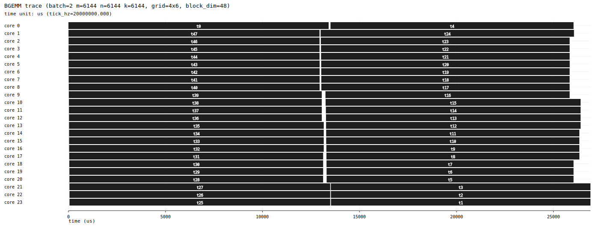

<p align="center">
  
</p>

# PTO Tile Library (PTO-ISA)

Parallel Tile Operation (PTO) is a virtual instruction set architecture for tile-level operations on Ascend NPUs, providing ~90 standard tile ops.
This repository provides a small compiler/runtime stack and a growing subset of portable tile operators built on PTO instruction sequences.

This repo contains two main pieces:

- **PTO-AS (`.pto`) + `ptoas`**: compile PTO assembly to Ascend CCE C++ (and a CPU simulator backend).
- **Runtime (`pto_runtime`)**: build a task graph in Python and run it on Ascend devices, optionally collecting per-task timing.

## Who is this for

This repo is not aimed at beginner-level users. It is aimed at:

- Backend/framework developers interfacing with Ascend hardware
- Operator developers building high-performance kernels
- Cross-platform developers porting tile kernels across Ascend generations

Related integrations:

- [PyPTO](https://gitcode.com/cann/pypto/)
- [TileLang Ascend](https://github.com/tile-ai/tilelang-ascend/)

## Platform support

- **Ascend A2 (910B) / A3 (910C)**: `include/pto/npu/a2a3/` (A2/A3 share the same backend today)
- **Ascend A5 (950)**: `include/pto/npu/a5/` (partial / WIP)
- **CPU (x86_64 / AArch64)**: debugging via the CPU backend

## Recommended workflow

1. Write kernels in Python → emit PTO-AS (`.pto`).
2. Verify correctness on CPU.
3. Run on Ascend hardware and profile.
4. Tune tile shapes, instruction order, and scheduling.

## Getting started

For more detailed setup notes, see `docs/getting-started.md`.

### 0) Python deps

```bash
python3 -m pip install -r requirements.txt
```

### 1) `ptoas` binary

`bin/ptoas` is a small wrapper that dispatches to an OS/arch-specific binary under `bin/<platform>/ptoas`.

- Linux aarch64: `bin/linux-aarch64/ptoas` (included)
- Linux x86_64: build from source (see `bin/linux-x86_64/README.md`)
- macOS aarch64: build from source (see `bin/macos-aarch64/README.md`)

Quick check:

```bash
./bin/ptoas --help
```

### 2) CPU-only end-to-end (Ubuntu/macOS)

```bash
python3 kernels/python/gemm/run.py --target cpu --ptoas ./bin/ptoas --outdir /tmp/pto_kernel_python_gemm
```

### 3) Ascend NPU prerequisites (Ubuntu aarch64)

```bash
export ASCEND_HOME_PATH=$HOME/Ascend/ascend-toolkit/latest
```

### 4) Runtime (auto-built)

No manual build step is required: `pto_runtime.py` builds/loads the host runtime and AICPU/AICore helper binaries on first use via `ref_runtime/python/binary_compiler.py` (requires `cmake`/`make` and the CANN toolchain).

### 5) Run BGEMM and generate a task trace (Ascend A2/A3)

This runs a batched GEMM on cube cores using the **runtime task graph** and exports:

- `trace.svg`: swimlane timeline (per-task start/end)
- `trace.json`: Chrome/Perfetto trace
- `task_profile.json`: raw per-task records

```bash
python3 kernels/python/bgemm_performance/run_runtime.py \
  --ptoas ./bin/ptoas --ascend-home $ASCEND_HOME_PATH \
  --device 0 --aic-blocks 24 \
  --batch 2 --m 6144 --n 6144 --k 6144 --grid-m 4 --grid-n 6 \
  --iters 10 --warmup 2 --no-check \
  --outdir /tmp/pto_bgemm_runtime_profile \
  --trace-json /tmp/pto_bgemm_runtime_profile/trace.json \
  --trace-svg  /tmp/pto_bgemm_runtime_profile/trace.svg
```

Outputs are written under `/tmp/pto_bgemm_runtime_profile/`:

- `kernel_0.pto` (generated PTO-AS)
- `kernel_0.cpp` (`ptoas` output, Ascend CCE C++)
- `ptoas.log` (`ptoas` logs)
- `trace.svg` / `trace.json` / `task_profile.json` (profiling output)

You should see staged logs (`=== Compile & load ===`, `=== Benchmark ===`, `=== Profile & trace export ===`) and:

```text
profile: wrote /tmp/pto_bgemm_runtime_profile/trace.svg
```

Example trace:



## How the BGEMM work is split

- The output is partitioned into `batch * grid_m * grid_n` independent tasks.
- Each task computes one `(M / grid_m) × (N / grid_n)` output tile and reduces the full K locally (`K / 64` tiles by default).
- The runtime schedules tasks across cube cores (A2/A3 typically have 24 cube cores), so `block_dim > 24` runs in waves.

## Running more kernels

- Regression runner (CPU / simulator / NPU): `kernels/python/run_regression.py`
- Kernel overview: `kernels/README.md`
- Standalone PTO-AS examples: `ptoas/examples/`
- Runtime examples: `runtime/example/basic_python/` and `examples/bgemm/`

## Repo layout

- `pto/` and `pto_as/`: Python frontends/utilities (generate PTO-AS, compile via `ptoas`, call runtime)
- `ptoas/`: PTO-AS compiler (`ptoas`) + Python tooling
- `runtime/`: task-graph runtime + `pto_runtime` Python bindings (Ascend)
- `kernels/`: kernel examples (Python frontends, performance runners)
- `include/pto/`: PTO intrinsic headers used by generated CCE C++
- `bin/`: `ptoas` wrapper + prebuilt binaries

## Docs

- `docs/getting-started.md`
- `bin/README.md` (prebuilt binaries and platform setup)
- `runtime/python/README.md` (Python API for the runtime)
- `include/README.md` (PTO header API + backend status)
