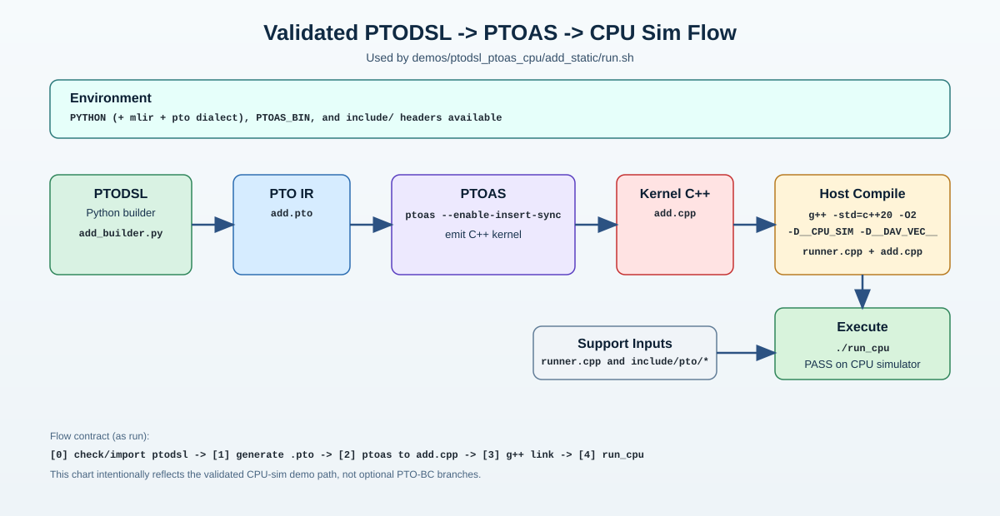

<p align="center">
  
</p>

# PTO Tile Library

High-performance **tile-level** operations for Ascend platforms, implemented against the **PTO (Parallel Tile Operation) virtual ISA**.

[](LICENSE)
[](#platform-support)
[](https://your-docs-url.github.io)

- **Docs**: `docs/` (start at [`docs/README.md`](docs/README.md))
- **Getting started** (Windows/Linux/macOS): [`docs/getting-started.md`](docs/getting-started.md)
- **ISA / headers**: [`include/README.md`](include/README.md)
- **中文文档**: [`README_zh.md`](README_zh.md)

## News

- **2026-02**: Added PTO-BC bytecode
- **2026-02**: Integrated PTOAS and PTODSL
- **2025-12-27**: PTO Tile Library becomes publicly available.

## What is PTO?

Ascend hardware evolves significantly across generations, and the underlying instruction sets change accordingly. **PTO** raises the abstraction level to a stable, tile-centric virtual ISA:

- Provides **90+ standard tile operations** (ISA definition)
- Bridges hardware generations while keeping **backward compatibility**
- Still exposes **performance tuning levers** (tile size/shape, instruction ordering, pipelining choices, etc.)

This repository implements a growing subset of PTO operations with performance-oriented kernels, CPU simulation, and tests.

## PTO Ecosystem & Toolchain

This is the central repository for the PTO ecosystem. It connects multiple components:



### Compilation Flow (PTODSL -> PTOAS -> CPU sim)

The SVG above now matches the validated demo pipeline in
[`demos/ptodsl_ptoas_cpu/add_static/run.sh`](demos/ptodsl_ptoas_cpu/add_static/run.sh):

1. Ensure `ptodsl` is importable in the selected Python environment.
2. Generate PTO text IR: `add_builder.py -> add.pto`.
3. Compile PTO IR with PTOAS: `ptoas --enable-insert-sync add.pto -o add.cpp`.
4. Compile host+kernel for CPU simulation:
   `g++ -std=c++20 -O2 -D__CPU_SIM -D__DAV_VEC__ runner.cpp add.cpp -o run_cpu`.
5. Run `./run_cpu` and verify `PASS`.

Example invocation:

```bash
export PTOAS_BIN=/path/to/ptoas
export PYTHON=/path/to/python
export PYTHONPATH=/path/to/mlir_core:$PYTHONPATH
bash demos/ptodsl_ptoas_cpu/add_static/run.sh
```

### Related Projects

| Project | Description | Location |
|---------|-------------|----------|
| **PTOAS** | PTO Assembler - MLIR-based compiler for PTO | [`PTOAS/`](PTOAS/) (submodule) |
| **PTODSL** | Python DSL for PTO kernel authoring | [`PTODSL/`](PTODSL/) (submodule) |
| **pyPTO** | Python-first frontend for PTO kernels | [External](https://gitcode.com/cann/pypto/) |
| **TileLang Ascend** | High-level framework integration | [External](https://github.com/tile-ai/tilelang-ascend/) |

### Tools

| Tool | Description | Usage |
|------|-------------|-------|
| `ptoas` | PTO Assembler - compiles PTO text to C++ | `ptoas input.pto -o output.cpp` |
| `ptobc` | PTO Bytecode encoder/decoder | `ptobc encode input.pto -o out.ptobc` |

For performance profiling, refer to the [msprof tool](https://www.hiascend.com/document/detail/zh/canncommercial/850/devaids/Profiling/atlasprofiling_16_0010.html).

## Intended Audience

PTO Tile Lib is not aimed at beginner-level users. It is intended for:

- Framework backends interfacing directly with Ascend hardware
- Cross-platform application developers targeting multiple Ascend generations
- High-performance operator/kernel developers (manual implementations)

## Platform Support

- Ascend A2 (Ascend 910B)
- Ascend A3 (Ascend 910C)
- Ascend A5 (Ascend 950)
- CPU simulator (x86_64 / AArch64)

For details, see: [Released PTO ISA](include/README.md)

## Requirements

### CPU simulator

- C++ toolchain (Clang/GCC/MSVC)
- CMake
- Python 3

### Ascend (NPU / simulator)

If you wish to directly browse the PTO ISA documentation online:

- [Documentation Center](https://pto-isa.gitcode.com)

To build the documentation locally, see the **Documentation Site (MkDocs)** section below.

- Ascend CANN toolkit **>= 8.3** (see `version.info`)
- A working runtime environment (`setenv.bash` sourced)

## Quickstart (CPU simulator)

CPU simulation is cross-platform and does **not** require Ascend drivers/CANN.

Run the full CPU flow:

```bash
python3 tests/run_cpu.py --clean --verbose
```

Run a demo (optional):

```bash
python3 tests/run_cpu.py --demo gemm --verbose
python3 tests/run_cpu.py --demo flash_attn --verbose
```

Run CPU simulation tests:

```bash
chmod +x ./tests/run_cpu_tests.sh
./tests/run_cpu_tests.sh
```

## Quickstart (Ascend ST)

> ST requires a working Ascend CANN environment and is typically Linux-only.

1) Configure CANN environment variables:

```bash
# root install
source /usr/local/Ascend/cann/bin/setenv.bash

# or non-root install
source $HOME/Ascend/cann/bin/setenv.bash
```

2) Run recommended suites:

```bash
chmod +x ./tests/run_st.sh
./tests/run_st.sh a5 npu simple
./tests/run_st.sh a3 sim all
```

3) Run a single ST test case:

```bash
python3 tests/script/run_st.py -r [sim|npu] -v [a3|a5] -t [TEST_CASE] -g [GTEST_FILTER_CASE]

# examples
python3 tests/script/run_st.py -r npu -v a3 -t tmatmul -g TMATMULTest.case1
python3 tests/script/run_st.py -r sim -v a5 -t tmatmul -g TMATMULTest.case1
```

Note: the `a3` backend covers the A2/A3 family (`include/pto/npu/a2a3`).

## Build / Package

One-click build & run:

```bash
chmod +x build.sh

# Run Full ST tests
./build.sh --run_all --a3 --sim

# Run Simplified ST tests
./build.sh --run_simple --a5 --npu

# Packaging
./build.sh --pkg
```

## Documentation Site (MkDocs)

An MkDocs (Read the Docs theme) site is available under `docs/mkdocs/`.

```bash
python -m pip install -r docs/mkdocs/requirements.txt
python -m mkdocs serve -f docs/mkdocs/mkdocs.yml
```

Build a static site:

```bash
python -m mkdocs build -f docs/mkdocs/mkdocs.yml
```

Build via CMake:

```bash
cmake -S docs -B build/docs -DPython3_EXECUTABLE=$PWD/.venv-mkdocs/bin/python
cmake --build build/docs --target pto_docs
```

## Documentation Overview

| Section | Description | Path |
|---------|-------------|------|
| **ISA Reference** | Complete instruction reference | [`docs/isa/`](docs/isa/) |
| **PTO-AS Grammar** | Assembly language specification | [`docs/grammar/PTO-AS.md`](docs/grammar/PTO-AS.md) |
| **PTO-BC Bytecode** | Binary encoding specification | [`docs/bytecode/pto-bc.md`](docs/bytecode/pto-bc.md) |
| **PTO-IR** | Non-ISA operations (L1/L2) | [`docs/ir/`](docs/ir/) |
| **Programming Guide** | Developer guides and tutorials | [`docs/coding/`](docs/coding/) |
| **Machine Model** | Abstract machine architecture | [`docs/machine/`](docs/machine/) |

## Performance References

This repository includes performance-oriented kernels with reference measurements and reproducible setups.

### GEMM (A2/A3 reference)

- Kernel: `kernels/manual/a2a3/gemm_performance/`
- Tuning notes: `kernels/manual/a2a3/gemm_performance/README.md`

Measured on Ascend A3 (24 cores) with fp16 inputs → fp32 output:

| Parameter | TMATMUL (Cube) Ratio | TEXTRACT Ratio | TLOAD Ratio | TSTORE Ratio | Execution time (ms) |
| --- | --- | --- | --- | --- | --- |
| `m=1536` `k=1536` `n=1536` | 54.5% | 42.2% | 72.2% | 7.7% | 0.0388 |
| `m=3072` `k=3072` `n=3072` | 79.0% | 62.0% | 90.9% | 5.8% | 0.2067 |
| `m=6144` `k=6144` `n=6144` | 86.7% | 68.1% | 95.2% | 3.1% | 1.5060 |
| `m=7680` `k=7680` `n=7680` | 80.6% | 63.0% | 98.4% | 2.4% | 3.1680 |


### Flash Attention (A2/A3 reference)

- Kernel: `kernels/manual/a2a3/flash_atten/`
- Tuning notes: `kernels/manual/a2a3/flash_atten/README.md`


## Roadmap

| Feature | Description | Scope |
| --- | --- | --- |
| PTO Auto Mode | BiSheng compiler support to automatically allocate tile buffers and insert synchronization. | Compiler / toolchain |
| PTO Tile Fusion | BiSheng compiler support to fuse tile operations automatically. | Compiler / toolchain |
| PTO-AS | Byte code support for PTO ISA. | Compiler / toolchain |
| Convolution extension | PTO ISA support for convolution kernels. | ISA extension |
| Collective communication extension | PTO ISA support for collective communication kernels. | ISA extension |
| System schedule extension | PTO ISA support for SPMD/MPMD programming. | ISA extension |

## Repository Structure

- `include/`: PTO C++ header files (see [include/README.md](include/README.md))
- `PTOAS/`: PTO Assembler and MLIR dialect (submodule)
- `PTODSL/`: Python DSL for kernel authoring (submodule)
- `kernels/`: Custom operators and kernel implementations (see [kernels/README.md](kernels/README.md))
- `docs/`: ISA instructions, API guidelines, and examples (see [docs/README.md](docs/README.md))
- `docs/grammar/`: PTO-AS assembly language specification
- `docs/bytecode/`: PTO-BC bytecode specification
- `docs/coding/tutorials/`: Step-by-step tutorials
- `tools/ptobc/`: PTO-BC encoder/decoder tool
- `tools/scripts/`: Packaging and release scripts
- `demos/`: Example kernels and demonstrations (see [demos/README.md](demos/README.md))
- `tests/`: ST/CPU test scripts and use cases (see [tests/README.md](tests/README.md))
- `build.sh`, `tests/run_st.sh`: Build, package, and run entry points

## Contributing

See: [CONTRIBUTING.md](CONTRIBUTING.md)

## Security

See: [SECURITY.md](SECURITY.md)

## License

This project is licensed under the CANN Open Software License Agreement Version 2.0. See the [LICENSE](LICENSE) file for details.

---

<p align="center">
  <strong>PTO Tile Library</strong> — Enabling high-performance tile operations across Ascend platforms
</p>
