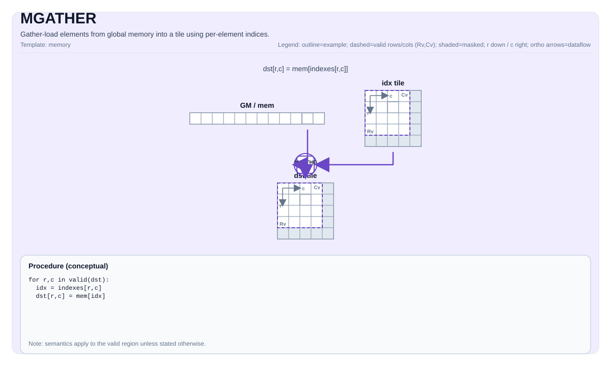

# MGATHER


## Tile Operation Diagram



## Introduction

Gather-load elements from global memory into a tile using per-element indices.

## Math Interpretation

For each element `(i, j)` in the destination valid region:

$$ \mathrm{dst}_{i,j} = \mathrm{mem}[\mathrm{idx}_{i,j}] $$

## Assembly Syntax

PTO-AS form: see `docs/grammar/PTO-AS.md`.

Synchronous form:

```text
mgather %dst, %mem, %idx : (!pto.tile<...>, !pto.tensor<...>, !pto.tile<...>)
```

### IR Level 1 (SSA)

```text
%dst = pto.mgather %mem, %idx : (!pto.partition_tensor_view<MxNxdtype>, pto.tile<...>)
-> !pto.tile<loc, dtype, rows, cols, blayout, slayout, fractal, pad>
```

### IR Level 2 (DPS)

```text
pto.mgather ins(%mem, %idx : !pto.partition_tensor_view<MxNxdtype>, !pto.tile_buf<...>) outs(%dst : !pto.tile_buf<...>)
```
## C++ Intrinsic

Declared in `include/pto/common/pto_instr.hpp`:

```cpp
template <typename TileDst, typename GlobalData, typename TileInd, typename... WaitEvents>
PTO_INST RecordEvent MGATHER(TileDst& dst, GlobalData& src, TileInd& indexes, WaitEvents&... events);
```

## Constraints

- Index interpretation is target-defined. The CPU simulator treats indices as linear element indices into `src.data()`.
- No bounds checks are enforced on `indexes` by the CPU simulator.

## Examples

See related examples in `docs/isa/` and `docs/coding/tutorials/`.

## ASM Form Examples

### Auto Mode

```text
# Auto mode: compiler/runtime-managed placement and scheduling.
%dst = pto.mgather %mem, %idx : (!pto.partition_tensor_view<MxNxdtype>, pto.tile<...>)
```

### Manual Mode

```text
# Manual mode: bind resources explicitly before issuing the instruction.
# Optional for tile operands:
# pto.tassign %arg0, @tile(0x1000)
# pto.tassign %arg1, @tile(0x2000)
%dst = pto.mgather %mem, %idx : (!pto.partition_tensor_view<MxNxdtype>, pto.tile<...>)
```

### PTO Assembly Form

```text
%dst = mgather %mem, %idx : !pto.memref<...>, !pto.tile<...> -> !pto.tile<...>
# IR Level 2 (DPS)
pto.mgather ins(%mem, %idx : !pto.partition_tensor_view<MxNxdtype>, !pto.tile_buf<...>) outs(%dst : !pto.tile_buf<...>)
```

