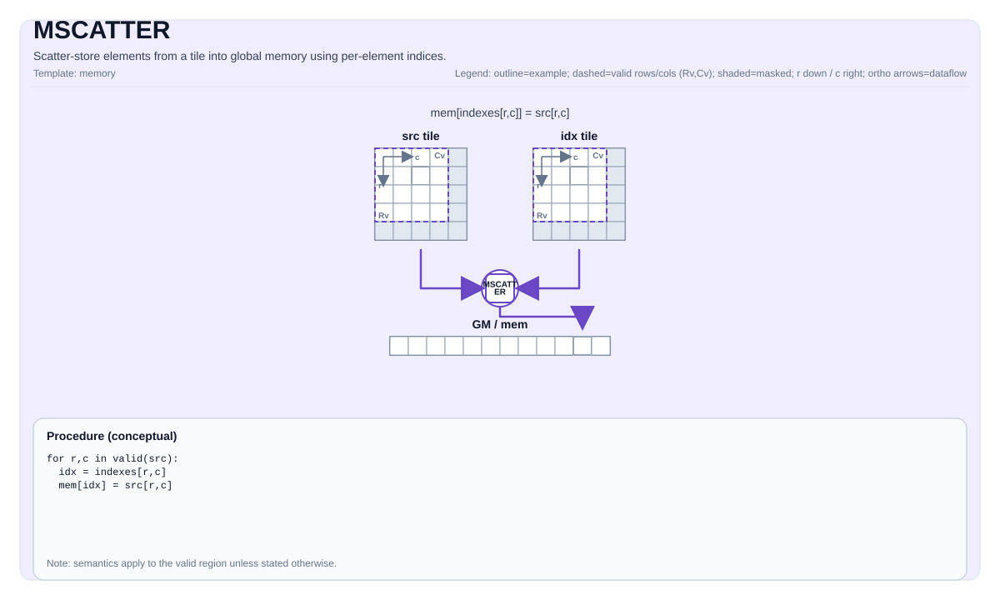

# MSCATTER


## Tile Operation Diagram



## Introduction

Scatter-store elements from a tile into global memory using per-element indices.

## Math Interpretation

For each element `(i, j)` in the source valid region:

$$ \mathrm{mem}[\mathrm{idx}_{i,j}] = \mathrm{src}_{i,j} $$

If multiple elements map to the same destination location, the final value is implementation-defined (CPU simulator: last writer wins in row-major iteration order).

## Assembly Syntax

PTO-AS form: see `docs/grammar/PTO-AS.md`.

Synchronous form:

```text
mscatter %mem, %src, %idx : (!pto.tensor<...>, !pto.tile<...>, !pto.tile<...>)
```

### IR Level 1 (SSA)

```text
pto.mscatter %src, %idx, %mem : (!pto.tile<...>, !pto.tile<...>, !pto.partition_tensor_view<MxNxdtype>) -> ()
```

### IR Level 2 (DPS)

```text
pto.mscatter ins(%src, %idx : !pto.tile_buf<...>, !pto.tile_buf<...>) outs(%mem : !pto.partition_tensor_view<MxNxdtype>)
```
## C++ Intrinsic

Declared in `include/pto/common/pto_instr.hpp`:

```cpp
template <typename GlobalData, typename TileSrc, typename TileInd, typename... WaitEvents>
PTO_INST RecordEvent MSCATTER(GlobalData& dst, TileSrc& src, TileInd& indexes, WaitEvents&... events);
```

## Constraints

- Index interpretation is target-defined. The CPU simulator treats indices as linear element indices into `dst.data()`.
- No bounds checks are enforced on `indexes` by the CPU simulator.

## Examples

See related examples in `docs/isa/` and `docs/coding/tutorials/`.

## ASM Form Examples

### Auto Mode

```text
# Auto mode: compiler/runtime-managed placement and scheduling.
pto.mscatter %src, %idx, %mem : (!pto.tile<...>, !pto.tile<...>, !pto.partition_tensor_view<MxNxdtype>) -> ()
```

### Manual Mode

```text
# Manual mode: bind resources explicitly before issuing the instruction.
# Optional for tile operands:
# pto.tassign %arg0, @tile(0x1000)
# pto.tassign %arg1, @tile(0x2000)
pto.mscatter %src, %idx, %mem : (!pto.tile<...>, !pto.tile<...>, !pto.partition_tensor_view<MxNxdtype>) -> ()
```

### PTO Assembly Form

```text
mscatter %src, %mem, %idx : !pto.memref<...>, !pto.tile<...>, !pto.tile<...>
# IR Level 2 (DPS)
pto.mscatter ins(%src, %idx : !pto.tile_buf<...>, !pto.tile_buf<...>) outs(%mem : !pto.partition_tensor_view<MxNxdtype>)
```

