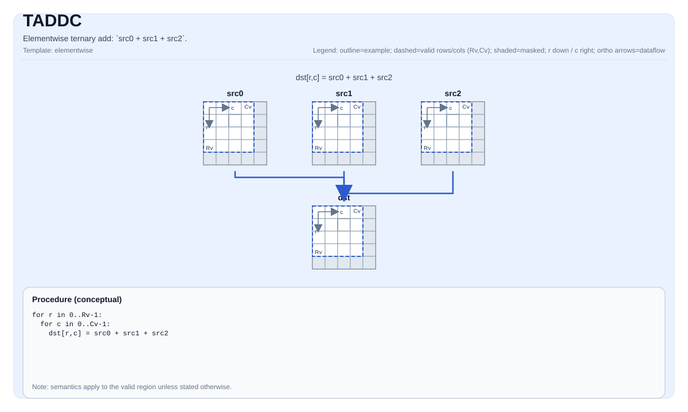

# TADDC


## Tile Operation Diagram



## Introduction

Elementwise ternary add: `src0 + src1 + src2`.

## Math Interpretation

For each element `(i, j)` in the valid region:

$$ \mathrm{dst}_{i,j} = \mathrm{src0}_{i,j} + \mathrm{src1}_{i,j} + \mathrm{src2}_{i,j} $$

## Assembly Syntax

PTO-AS form: see `docs/grammar/PTO-AS.md`.

Synchronous form:

```text
taddc %dst, %src0, %src1, %src2 : (!pto.tile<...>, !pto.tile<...>, !pto.tile<...>, !pto.tile<...>)
```

### IR Level 1 (SSA)

```text
%dst = pto.taddc %src0, %src1, %src2 : (!pto.tile<...>, !pto.tile<...>, !pto.tile<...>) -> !pto.tile<...>
```

### IR Level 2 (DPS)

```text
pto.taddc ins(%src0, %src1, %src2 : !pto.tile_buf<...>, !pto.tile_buf<...>, !pto.tile_buf<...>) outs(%dst : !pto.tile_buf<...>)
```
## C++ Intrinsic

Declared in `include/pto/common/pto_instr.hpp`:

```cpp
template <typename TileData, typename... WaitEvents>
PTO_INST RecordEvent TADDC(TileData& dst, TileData& src0, TileData& src1, TileData& src2, WaitEvents&... events);
```

## Constraints

- The op iterates over `dst.GetValidRow()` / `dst.GetValidCol()`.

## Examples

```cpp
#include <pto/pto-inst.hpp>

using namespace pto;

void example() {
  using TileT = Tile<TileType::Vec, float, 16, 16>;
  TileT a, b, c, out;
  TADDC(out, a, b, c);
}
```

## ASM Form Examples

### Auto Mode

```text
# Auto mode: compiler/runtime-managed placement and scheduling.
%dst = pto.taddc %src0, %src1, %src2 : (!pto.tile<...>, !pto.tile<...>, !pto.tile<...>) -> !pto.tile<...>
```

### Manual Mode

```text
# Manual mode: bind resources explicitly before issuing the instruction.
# Optional for tile operands:
# pto.tassign %arg0, @tile(0x1000)
# pto.tassign %arg1, @tile(0x2000)
%dst = pto.taddc %src0, %src1, %src2 : (!pto.tile<...>, !pto.tile<...>, !pto.tile<...>) -> !pto.tile<...>
```

### PTO Assembly Form

```text
%dst = taddc %src0, %src1, %src2 : !pto.tile<...>
# IR Level 2 (DPS)
pto.taddc ins(%src0, %src1, %src2 : !pto.tile_buf<...>, !pto.tile_buf<...>, !pto.tile_buf<...>) outs(%dst : !pto.tile_buf<...>)
```

