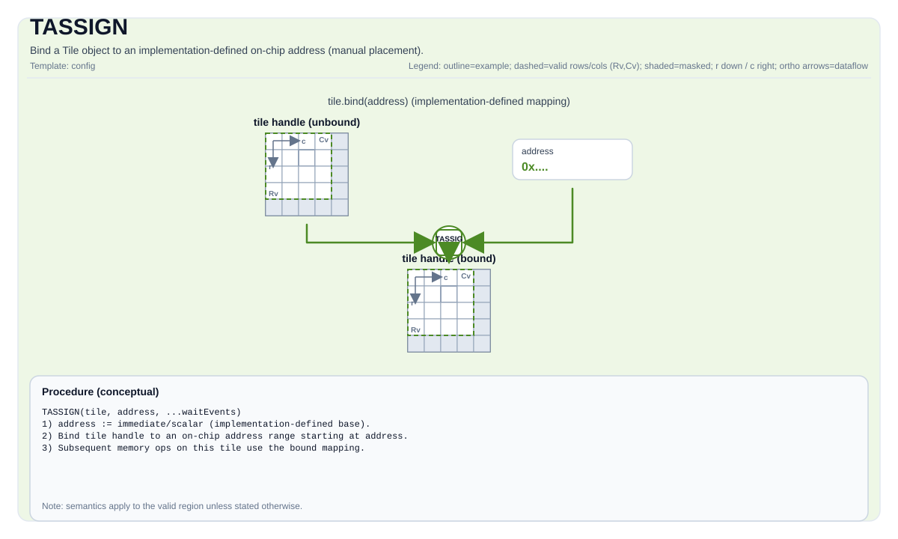

# TASSIGN


## Tile Operation Diagram



## Introduction

Bind a Tile object to an implementation-defined on-chip address (manual placement).

## Math Interpretation

Not applicable.

## Assembly Syntax

PTO-AS form: see `docs/grammar/PTO-AS.md`.

`TASSIGN` is typically introduced by bufferization/lowering when mapping tile values to physical storage.

Synchronous form:

```text
tassign %tile, %addr : !pto.tile<...>, index
```

### IR Level 1 (SSA)

```text
pto.tassign %tile, %addr : !pto.tile<...>, dtype
```

### IR Level 2 (DPS)

```text
pto.tassign ins(%tile, %addr : !pto.tile_buf<...>, dtype)
```
## C++ Intrinsic

Declared in `include/pto/common/pto_instr.hpp`:

```cpp
template <typename T, typename AddrType>
PTO_INST void TASSIGN(T& obj, AddrType addr);
```

## Constraints

- **Implementation checks**:
  - If `obj` is a Tile:
    - In manual mode (when `__PTO_AUTO__` is not defined), `addr` must be an integral type and is reinterpreted as the tile's storage address.
    - In auto mode (when `__PTO_AUTO__` is defined), `TASSIGN(tile, addr)` is a no-op.
  - If `obj` is a `GlobalTensor`:
    - `addr` must be a pointer type.
    - The pointed-to element type must match `GlobalTensor::DType`.

## Examples

### Auto

```cpp
#include <pto/pto-inst.hpp>

using namespace pto;

void example_auto() {
  using TileT = Tile<TileType::Vec, float, 16, 16>;
  TileT t;
  TASSIGN(t, 0x1000);
}
```

### Manual

```cpp
#include <pto/pto-inst.hpp>

using namespace pto;

void example_manual() {
  using TileT = Tile<TileType::Vec, float, 16, 16>;
  TileT a, b, c;
  TASSIGN(a, 0x1000);
  TASSIGN(b, 0x2000);
  TASSIGN(c, 0x3000);
  TADD(c, a, b);
}
```

## ASM Form Examples

### Auto Mode

```text
# Auto mode: compiler/runtime-managed placement and scheduling.
pto.tassign %tile, %addr : !pto.tile<...>, dtype
```

### Manual Mode

```text
# Manual mode: bind resources explicitly before issuing the instruction.
# Optional for tile operands:
# pto.tassign %arg0, @tile(0x1000)
# pto.tassign %arg1, @tile(0x2000)
pto.tassign %tile, %addr : !pto.tile<...>, dtype
```

### PTO Assembly Form

```text
tassign %tile, %addr : !pto.tile<...>, index
# IR Level 2 (DPS)
pto.tassign ins(%tile, %addr : !pto.tile_buf<...>, dtype)
```

