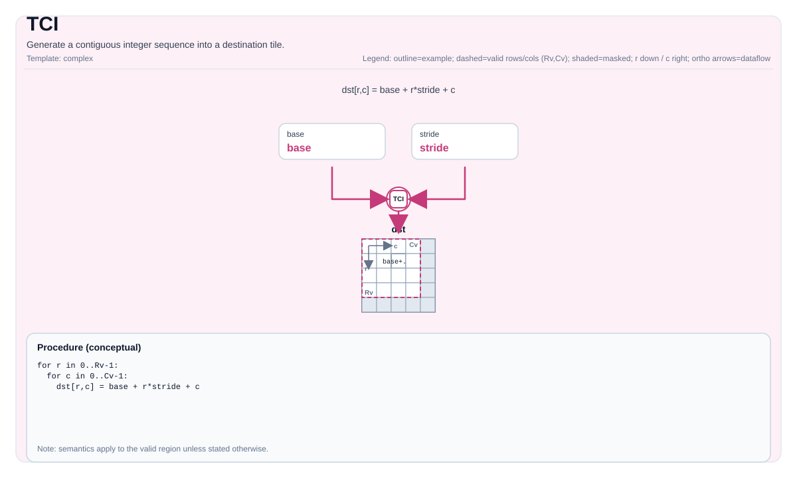

# TCI


## Tile Operation Diagram



## Introduction

Generate a contiguous integer sequence into a destination tile.

## Math Interpretation

For a linearized index `k` over the valid elements:

- Ascending:

  $$ \mathrm{dst}_{k} = S + k $$

- Descending:

  $$ \mathrm{dst}_{k} = S - k $$

The linearization order depends on the tile layout (implementation-defined).

## Assembly Syntax

PTO-AS form: see `docs/grammar/PTO-AS.md`.

Synchronous form:

```text
tci %dst, %S {descending = false} : (!pto.tile<...>, !pto.tile<...>)
```

### IR Level 1 (SSA)

```text
%dst = pto.tci %scalar {descending = false} : dtype -> !pto.tile<...>
```

### IR Level 2 (DPS)

```text
pto.tci ins(%scalar {descending = false} : dtype) outs(%dst : !pto.tile_buf<...>)
```
## C++ Intrinsic

Declared in `include/pto/common/pto_instr.hpp`:

```cpp
template <typename TileData, typename T, int descending, typename... WaitEvents>
PTO_INST RecordEvent TCI(TileData& dst, T S, WaitEvents&... events);
```

## Constraints

- **Implementation checks (A2A3/A5)**:
  - `TileData::DType` must be exactly the same type as the scalar template parameter `T`.
  - `dst/scalar` element types must be identical, and must be one of: `int32_t`, `uint32_t`, `int16_t`, `uint16_t`.
  - `TileData::Cols != 1` (this is the condition enforced by the implementation).
- **Valid region**:
  - The implementation uses `dst.GetValidCol()` as the sequence length and does not consult `dst.GetValidRow()`.

## Examples

### Auto

```cpp
#include <pto/pto-inst.hpp>

using namespace pto;

void example_auto() {
  using TileT = Tile<TileType::Vec, int32_t, 1, 16>;
  TileT dst;
  TCI<TileT, int32_t, /*descending=*/0>(dst, /*S=*/0);
}
```

### Manual

```cpp
#include <pto/pto-inst.hpp>

using namespace pto;

void example_manual() {
  using TileT = Tile<TileType::Vec, int32_t, 1, 16>;
  TileT dst;
  TASSIGN(dst, 0x1000);
  TCI<TileT, int32_t, /*descending=*/1>(dst, /*S=*/100);
}
```

## ASM Form Examples

### Auto Mode

```text
# Auto mode: compiler/runtime-managed placement and scheduling.
%dst = pto.tci %scalar {descending = false} : dtype -> !pto.tile<...>
```

### Manual Mode

```text
# Manual mode: bind resources explicitly before issuing the instruction.
# Optional for tile operands:
# pto.tassign %arg0, @tile(0x1000)
# pto.tassign %arg1, @tile(0x2000)
%dst = pto.tci %scalar {descending = false} : dtype -> !pto.tile<...>
```

### PTO Assembly Form

```text
%dst = tci %S {descending = false} : !pto.tile<...>
# IR Level 2 (DPS)
pto.tci ins(%scalar {descending = false} : dtype) outs(%dst : !pto.tile_buf<...>)
```

