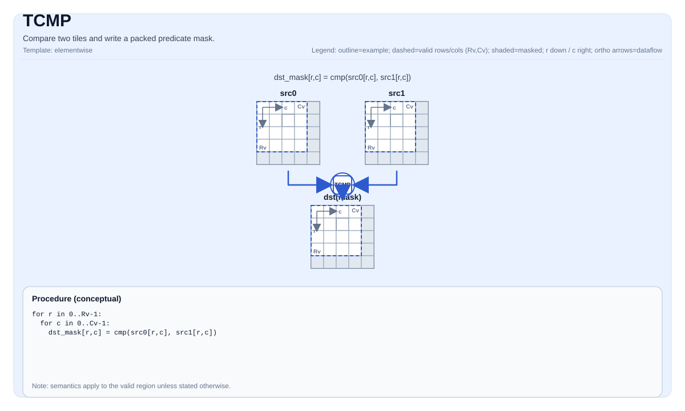

# TCMP


## Tile Operation Diagram



## Introduction

Compare two tiles and write a packed predicate mask.

## Math Interpretation

Conceptually, for each element `(i, j)` in the valid region, define a predicate:

$$ p_{i,j} = \left(\mathrm{src0}_{i,j}\ \mathrm{cmpMode}\ \mathrm{src1}_{i,j}\right) $$

The predicate mask is stored in `dst` using an implementation-defined packed layout.

## Assembly Syntax

PTO-AS form: see `docs/grammar/PTO-AS.md`.

Synchronous form:

```text
tcmp %dst, %src0, %src1 {cmpMode = #pto.cmp<EQ>} : (!pto.tile<...>, !pto.tile<...>)
```

### IR Level 1 (SSA)

```text
%dst = pto.tcmp %src0, %src1{cmpMode = #pto<cmp xx>}: (!pto.tile<...>, !pto.tile<...>) -> !pto.tile<...>
```

### IR Level 2 (DPS)

```text
pto.tcmp ins(%src0, %src1{cmpMode = #pto<cmp xx>}: !pto.tile_buf<...>, !pto.tile_buf<...>) outs(%dst : !pto.tile_buf<...>)
```
## C++ Intrinsic

Declared in `include/pto/common/pto_instr.hpp` and `include/pto/common/type.hpp`:

```cpp
template <typename TileDataDst, typename TileDataSrc, typename... WaitEvents>
PTO_INST RecordEvent TCMP(TileDataDst& dst, TileDataSrc& src0, TileDataSrc& src1, CmpMode cmpMode,
                          WaitEvents&... events);
```

## Constraints

- **Implementation checks (A2A3)**:
  - Input type must be one of: `int32_t`, `half`, `float`.
  - Output type must be `uint8_t`.
  - `src0/src1/dst` tile location must be `TileType::Vec`.
  - Static valid bounds: `TileDataSrc::ValidRow <= TileDataSrc::Rows` and `TileDataSrc::ValidCol <= TileDataSrc::Cols`.
  - Runtime: `src0.GetValidRow() == dst.GetValidRow()` and `src0.GetValidCol() == dst.GetValidCol()`.
  - Note: `src1` shape/valid is not validated by explicit runtime assertions in this implementation.
  - For `TileDataSrc::DType == int32_t`, the implementation uses the `EQ` compare path regardless of `cmpMode`.
- **Implementation checks (A5)**:
  - Input type must be one of: `uint32_t`, `int32_t`, `uint16_t`, `int16_t`, `uint8_t`,  `int8_t`, `float`, `half`.
  - Output type must be `uint32_t`.
  - Implemented (see `include/pto/npu/a5/TCmp.hpp`).
  - The A5 implementation uses `dst.GetValidRow()` / `dst.GetValidCol()` as the iteration domain and writes a packed predicate mask into `dst` (target-defined packing).
- **Mask encoding**:
  - The mask tile is interpreted as packed predicate bits in a target-defined layout.

## Examples

### Auto

```cpp
#include <pto/pto-inst.hpp>

using namespace pto;

void example_auto() {
  using SrcT = Tile<TileType::Vec, float, 16, 16>;
  using MaskT = Tile<TileType::Vec, uint8_t, 16, 32, BLayout::RowMajor, -1, -1>;
  SrcT src0, src1;
  MaskT mask(16, 2);
  TCMP(mask, src0, src1, CmpMode::GT);
}
```

### Manual

```cpp
#include <pto/pto-inst.hpp>

using namespace pto;

void example_manual() {
  using SrcT = Tile<TileType::Vec, float, 16, 16>;
  using MaskT = Tile<TileType::Vec, uint8_t, 16, 32, BLayout::RowMajor, -1, -1>;
  SrcT src0, src1;
  MaskT mask(16, 2);
  TASSIGN(src0, 0x1000);
  TASSIGN(src1, 0x2000);
  TASSIGN(mask, 0x3000);
  TCMP(mask, src0, src1, CmpMode::GT);
}
```

## ASM Form Examples

### Auto Mode

```text
# Auto mode: compiler/runtime-managed placement and scheduling.
%dst = pto.tcmp %src0, %src1{cmpMode = #pto<cmp xx>}: (!pto.tile<...>, !pto.tile<...>) -> !pto.tile<...>
```

### Manual Mode

```text
# Manual mode: bind resources explicitly before issuing the instruction.
# Optional for tile operands:
# pto.tassign %arg0, @tile(0x1000)
# pto.tassign %arg1, @tile(0x2000)
%dst = pto.tcmp %src0, %src1{cmpMode = #pto<cmp xx>}: (!pto.tile<...>, !pto.tile<...>) -> !pto.tile<...>
```

### PTO Assembly Form

```text
%dst = tcmp %src0, %src1 {cmpMode = #pto.cmp<EQ>} : !pto.tile<...> -> !pto.tile<...>
# IR Level 2 (DPS)
pto.tcmp ins(%src0, %src1{cmpMode = #pto<cmp xx>}: !pto.tile_buf<...>, !pto.tile_buf<...>) outs(%dst : !pto.tile_buf<...>)
```

