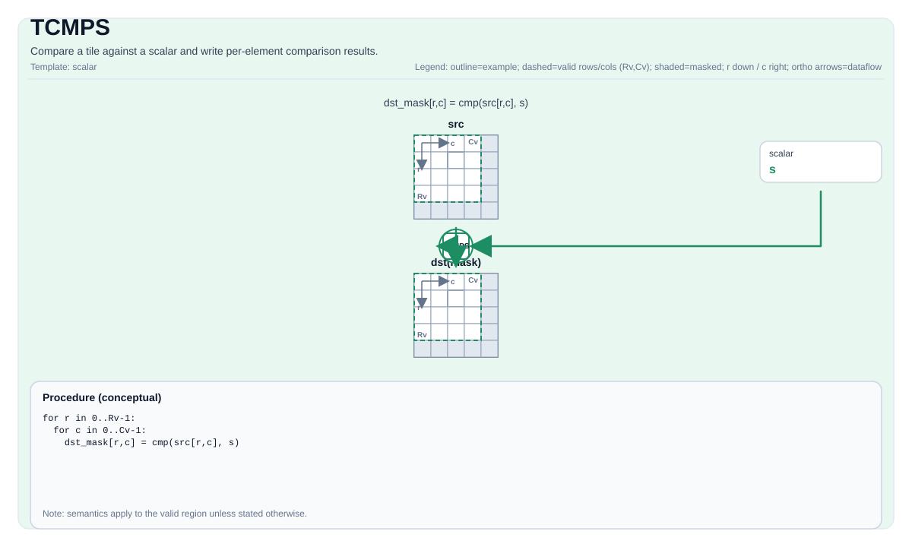

# TCMPS


## Tile Operation Diagram



## Introduction

Compare a tile against a scalar and write per-element comparison results.

## Math Interpretation

For each element `(i, j)` in the valid region:

$$ \mathrm{dst}_{i,j} = \left(\mathrm{src}_{i,j}\ \mathrm{cmpMode}\ \mathrm{scalar}\right) $$

The encoding/type of `dst` is implementation-defined (often a mask-like tile).

## Assembly Syntax

PTO-AS form: see `docs/grammar/PTO-AS.md`.

Synchronous form:

```text
tcmps %dst, %src, %scalar {cmpMode = #pto.cmp<EQ>} : (!pto.tile<...>, !pto.tile<...>)
```

### IR Level 1 (SSA)

```text
%dst = pto.tcmps %src, %scalar {cmpMode = #pto<cmp xx>} : (!pto.tile<...>, dtype) -> !pto.tile<...>
```

### IR Level 2 (DPS)

```text
pto.tcmps ins(%src, %scalar{cmpMode = #pto<cmp xx>}: !pto.tile_buf<...>, dtype) outs(%dst : !pto.tile_buf<...>)
```
## C++ Intrinsic

Declared in `include/pto/common/pto_instr.hpp` and `include/pto/common/type.hpp`:

```cpp
template <typename TileDataDst, typename TileDataSrc0, typename T, typename... WaitEvents>
PTO_INST RecordEvent TCMPS(TileDataDst& dst, TileDataSrc0& src0, T src1, CmpMode cmpMode, WaitEvents&... events);
```

## Constraints

- **Implementation checks (A2A3)**:
  - `src0` and `dst` tile location must be vector (`TileType::Vec`).
  - Static valid bounds: `TileDataSrc0::ValidRow <= TileDataSrc0::Rows` and `TileDataSrc0::ValidCol <= TileDataSrc0::Cols`.
  - Runtime: `src0.GetValidRow() == dst.GetValidRow()` and `src0.GetValidCol() == dst.GetValidCol()`.
- **Implementation checks (A5)**:
  - No explicit `static_assert`/`PTO_ASSERT` shape checks are enforced by `TCMPS_IMPL`.
  - Effective support depends on `TileDataSrc0::DType` (only specific 1/2/4-byte integer/float types are dispatched in the implementation).
- **Valid region**:
  - The implementation uses `dst.GetValidRow()` / `dst.GetValidCol()` as the iteration domain.

## Examples

### Auto

```cpp
#include <pto/pto-inst.hpp>

using namespace pto;

void example_auto() {
  using SrcT = Tile<TileType::Vec, float, 16, 16>;
  using DstT = Tile<TileType::Vec, uint8_t, 16, 32, BLayout::RowMajor, -1, -1>;
  SrcT src;
  DstT dst(16, 2);
  TCMPS(dst, src, 0.0f, CmpMode::GT);
}
```

### Manual

```cpp
#include <pto/pto-inst.hpp>

using namespace pto;

void example_manual() {
  using SrcT = Tile<TileType::Vec, float, 16, 16>;
  using DstT = Tile<TileType::Vec, uint8_t, 16, 32, BLayout::RowMajor, -1, -1>;
  SrcT src;
  DstT dst(16, 2);
  TASSIGN(src, 0x1000);
  TASSIGN(dst, 0x2000);
  TCMPS(dst, src, 0.0f, CmpMode::GT);
}
```

## ASM Form Examples

### Auto Mode

```text
# Auto mode: compiler/runtime-managed placement and scheduling.
%dst = pto.tcmps %src, %scalar {cmpMode = #pto<cmp xx>} : (!pto.tile<...>, dtype) -> !pto.tile<...>
```

### Manual Mode

```text
# Manual mode: bind resources explicitly before issuing the instruction.
# Optional for tile operands:
# pto.tassign %arg0, @tile(0x1000)
# pto.tassign %arg1, @tile(0x2000)
%dst = pto.tcmps %src, %scalar {cmpMode = #pto<cmp xx>} : (!pto.tile<...>, dtype) -> !pto.tile<...>
```

### PTO Assembly Form

```text
%dst = tcmps %src, %scalar {cmpMode = #pto.cmp<EQ>} : !pto.tile<...> -> !pto.tile<...>
# IR Level 2 (DPS)
pto.tcmps ins(%src, %scalar{cmpMode = #pto<cmp xx>}: !pto.tile_buf<...>, dtype) outs(%dst : !pto.tile_buf<...>)
```

