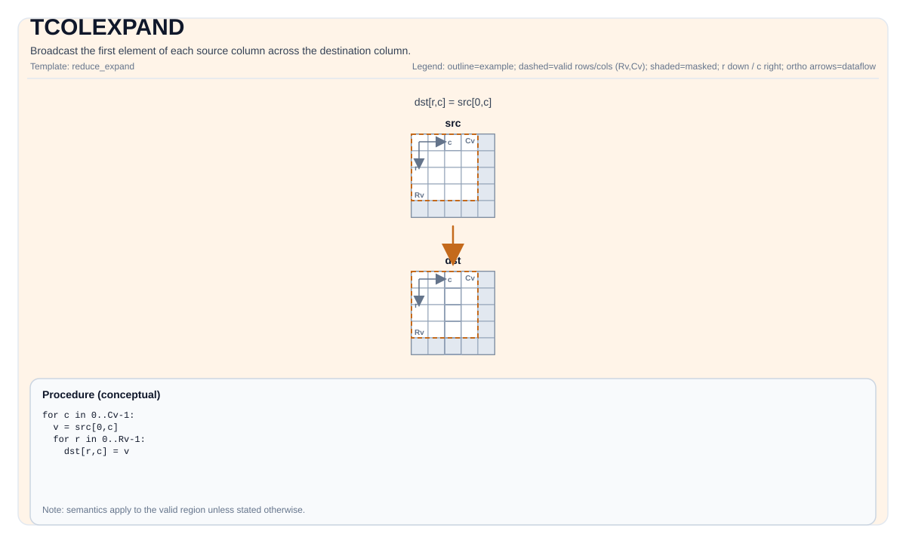

# TCOLEXPAND


## Tile Operation Diagram



## Introduction

Broadcast the first element of each source column across the destination column.

## Math Interpretation

Let `R = dst.GetValidRow()` and `C = dst.GetValidCol()`. For `0 <= i < R` and `0 <= j < C`:

$$ \mathrm{dst}_{i,j} = \mathrm{src}_{0,j} $$

## Assembly Syntax

PTO-AS form: see `docs/grammar/PTO-AS.md`.

Synchronous form:

```text
tcolexpand %dst, %src : (!pto.tile<...>, !pto.tile<...>)
```

### IR Level 1 (SSA)

```text
%dst = pto.tcolexpand %src : !pto.tile<...> -> !pto.tile<...>
```

### IR Level 2 (DPS)

```text
pto.tcolexpand ins(%src : !pto.tile_buf<...>) outs(%dst : !pto.tile_buf<...>)
```
## C++ Intrinsic

Declared in `include/pto/common/pto_instr.hpp`:

```cpp
template <typename TileDataDst, typename TileDataSrc, typename... WaitEvents>
PTO_INST RecordEvent TCOLEXPAND(TileDataDst& dst, TileDataSrc& src, WaitEvents&... events);
```

## Constraints

- The op iterates over `dst.GetValidRow()` / `dst.GetValidCol()`.

## Examples

```cpp
#include <pto/pto-inst.hpp>

using namespace pto;

void example() {
  using TileT = Tile<TileType::Vec, float, 16, 16>;
  TileT src, dst;
  TCOLEXPAND(dst, src);
}
```

## ASM Form Examples

### Auto Mode

```text
# Auto mode: compiler/runtime-managed placement and scheduling.
%dst = pto.tcolexpand %src : !pto.tile<...> -> !pto.tile<...>
```

### Manual Mode

```text
# Manual mode: bind resources explicitly before issuing the instruction.
# Optional for tile operands:
# pto.tassign %arg0, @tile(0x1000)
# pto.tassign %arg1, @tile(0x2000)
%dst = pto.tcolexpand %src : !pto.tile<...> -> !pto.tile<...>
```

### PTO Assembly Form

```text
%dst = tcolexpand %src : !pto.tile<...> -> !pto.tile<...>
# IR Level 2 (DPS)
pto.tcolexpand ins(%src : !pto.tile_buf<...>) outs(%dst : !pto.tile_buf<...>)
```

