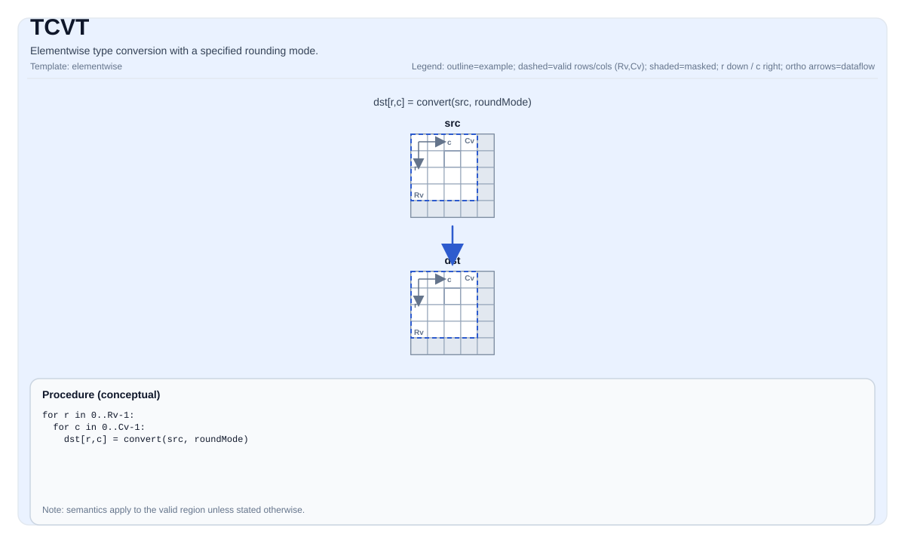

# TCVT


## Tile Operation Diagram



## Introduction

Elementwise type conversion with a specified rounding mode.

## Math Interpretation

For each element `(i, j)` in the valid region:

$$ \mathrm{dst}_{i,j} = \mathrm{cast}_{\mathrm{rmode}}\!\left(\mathrm{src}_{i,j}\right) $$

where `rmode` is a rounding policy (see `pto::RoundMode`).

## Assembly Syntax

PTO-AS form: see `docs/grammar/PTO-AS.md`.

Synchronous form:

```text
tcvt %dst, %src {rmode = #pto.round_mode<CAST_RINT>} : (!pto.tile<...>, !pto.tile<...>)
```

### IR Level 1 (SSA)

```text
%dst = pto.tcvt %src{rmode = #pto<round_mode xx>}: !pto.tile<...> -> !pto.tile<...>
```

### IR Level 2 (DPS)

```text
pto.tcvt ins(%src{rmode = #pto<round_mode xx>}: !pto.tile_buf<...>) outs(%dst : !pto.tile_buf<...>)
```
## C++ Intrinsic

Declared in `include/pto/common/pto_instr.hpp` and `include/pto/common/constants.hpp`:

```cpp
template <typename TileDataD, typename TileDataS, typename... WaitEvents>
PTO_INST RecordEvent TCVT(TileDataD& dst, TileDataS& src, RoundMode mode, WaitEvents&... events);
```

## Constraints

- `dst` and `src` must be compatible in shape/valid region as required by the implementation.
- The conversion `(src element type) -> (dst element type)` must be supported by the target for the given `RoundMode`.
- **Implementation notes (A2A3/A5)**:
  - `TCVT_IMPL` does not enforce additional `static_assert`/`PTO_ASSERT` checks on the type pair; unsupported conversions are target-defined.

## Examples

### Auto

```cpp
#include <pto/pto-inst.hpp>

using namespace pto;

void example_auto() {
  using SrcT = Tile<TileType::Vec, float, 16, 16>;
  using DstT = Tile<TileType::Vec, half, 16, 16>;
  SrcT src;
  DstT dst;
  TCVT(dst, src, RoundMode::CAST_RINT);
}
```

### Manual

```cpp
#include <pto/pto-inst.hpp>

using namespace pto;

void example_manual() {
  using SrcT = Tile<TileType::Vec, float, 16, 16>;
  using DstT = Tile<TileType::Vec, half, 16, 16>;
  SrcT src;
  DstT dst;
  TASSIGN(src, 0x1000);
  TASSIGN(dst, 0x2000);
  TCVT(dst, src, RoundMode::CAST_RINT);
}
```

## ASM Form Examples

### Auto Mode

```text
# Auto mode: compiler/runtime-managed placement and scheduling.
%dst = pto.tcvt %src{rmode = #pto<round_mode xx>}: !pto.tile<...> -> !pto.tile<...>
```

### Manual Mode

```text
# Manual mode: bind resources explicitly before issuing the instruction.
# Optional for tile operands:
# pto.tassign %arg0, @tile(0x1000)
# pto.tassign %arg1, @tile(0x2000)
%dst = pto.tcvt %src{rmode = #pto<round_mode xx>}: !pto.tile<...> -> !pto.tile<...>
```

### PTO Assembly Form

```text
%dst = tcvt %src {rmode = #pto.round_mode<CAST_RINT>} : !pto.tile<...> -> !pto.tile<...>
# IR Level 2 (DPS)
pto.tcvt ins(%src{rmode = #pto<round_mode xx>}: !pto.tile_buf<...>) outs(%dst : !pto.tile_buf<...>)
```

