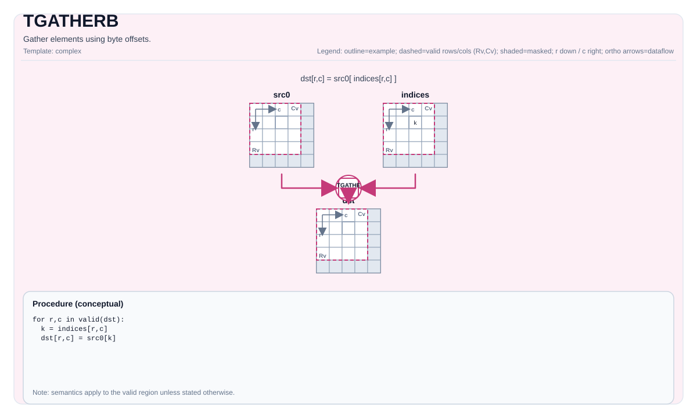

# TGATHERB


## Tile Operation Diagram



## Introduction

Gather elements using byte offsets.

## Math Interpretation

For each element in the valid region:

$$ \mathrm{dst}_{i,j} = *\left(\mathrm{srcBase} + \mathrm{offset}_{i,j}\right) $$

Exact bounds behavior is implementation-defined.

## Assembly Syntax

PTO-AS form: see `docs/grammar/PTO-AS.md`.

Synchronous form:

```text
tgatherb %dst, %src, %offsets : (!pto.tile<...>, !pto.tile<...>)
```

### IR Level 1 (SSA)

```text
%dst = pto.tgatherb %src, %offsets : (!pto.tile<...>, !pto.tile<...>) -> !pto.tile<...>
```

### IR Level 2 (DPS)

```text
pto.tgatherb ins(%src, %offsets : !pto.tile_buf<...>, !pto.tile_buf<...>) outs(%dst : !pto.tile_buf<...>)
```
## C++ Intrinsic

Declared in `include/pto/common/pto_instr.hpp`:

```cpp
template <typename TileDataDst, typename TileDataSrc, typename TileDataOffset, typename... WaitEvents>
PTO_INST RecordEvent TGATHERB(TileDataDst& dst, TileDataSrc& src, TileDataOffset& offset, WaitEvents&... events);
```

## Constraints

- **Implementation checks (A2A3)**:
  - Destination layout must be row-major (`TileDataDst::isRowMajor`).
  - Destination element size must be `1`, `2`, or `4` bytes (enforced via `static_assert` in the helper).
  - `SrcTileData::DType`/`DstTileData::DType` must be `int8_t` or `uint8_t` or `int16_t` or `uint16_t` or `int32_t` or `uint32_t` or `half` or `bfloat16_t` or `float`.
- **Implementation checks (A5)**:
  - Destination element size must be `1`, `2`, or `4` bytes.
  - `SrcTileData::DType`/`DstTileData::DType` must be `int8_t` or `uint8_t` or `int16_t` or `uint16_t` or `int32_t` or `uint32_t` or `half` or `bfloat16_t` or `float`.
- **Offset interpretation**:
  - Offsets are interpreted as `uint32_t` values (byte offsets) by the implementation.
  - Offset bounds are not validated by explicit runtime assertions; out-of-range offsets are target-defined.

## Examples

### Auto

```cpp
#include <pto/pto-inst.hpp>

using namespace pto;

void example_auto() {
  using SrcT = Tile<TileType::Vec, uint8_t, 1, 256>;
  using OffT = Tile<TileType::Vec, uint32_t, 1, 256>;
  using DstT = Tile<TileType::Vec, uint8_t, 1, 256>;
  SrcT src;
  OffT off;
  DstT dst;
  TGATHERB(dst, src, off);
}
```

### Manual

```cpp
#include <pto/pto-inst.hpp>

using namespace pto;

void example_manual() {
  using SrcT = Tile<TileType::Vec, uint8_t, 1, 256>;
  using OffT = Tile<TileType::Vec, uint32_t, 1, 256>;
  using DstT = Tile<TileType::Vec, uint8_t, 1, 256>;
  SrcT src;
  OffT off;
  DstT dst;
  TASSIGN(src, 0x1000);
  TASSIGN(off, 0x2000);
  TASSIGN(dst, 0x3000);
  TGATHERB(dst, src, off);
}
```

## ASM Form Examples

### Auto Mode

```text
# Auto mode: compiler/runtime-managed placement and scheduling.
%dst = pto.tgatherb %src, %offsets : (!pto.tile<...>, !pto.tile<...>) -> !pto.tile<...>
```

### Manual Mode

```text
# Manual mode: bind resources explicitly before issuing the instruction.
# Optional for tile operands:
# pto.tassign %arg0, @tile(0x1000)
# pto.tassign %arg1, @tile(0x2000)
%dst = pto.tgatherb %src, %offsets : (!pto.tile<...>, !pto.tile<...>) -> !pto.tile<...>
```

### PTO Assembly Form

```text
%dst = tgatherb %src, %offsets : !pto.tile<...> -> !pto.tile<...>
# IR Level 2 (DPS)
pto.tgatherb ins(%src, %offsets : !pto.tile_buf<...>, !pto.tile_buf<...>) outs(%dst : !pto.tile_buf<...>)
```

