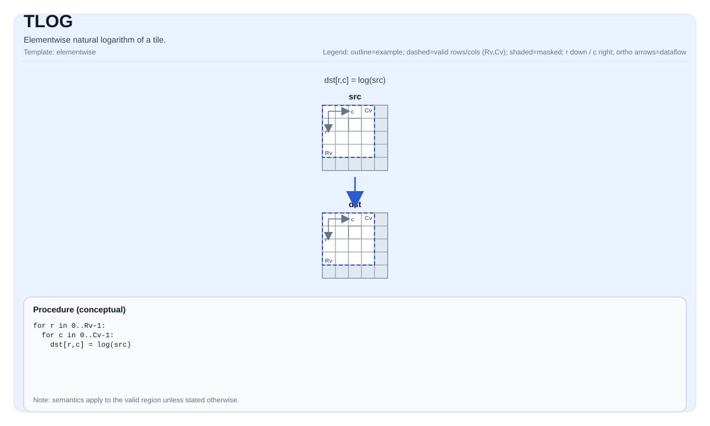

# TLOG


## Tile Operation Diagram



## Introduction

Elementwise natural logarithm of a tile.

## Math Interpretation

For each element `(i, j)` in the valid region:

$$ \mathrm{dst}_{i,j} = \log(\mathrm{src}_{i,j}) $$

## Assembly Syntax

PTO-AS form: see `docs/grammar/PTO-AS.md`.

Synchronous form:

```text
tlog %dst, %src : (!pto.tile<...>, !pto.tile<...>)
```

### IR Level 1 (SSA)

```text
%dst = pto.tlog %src : !pto.tile<...> -> !pto.tile<...>
```

### IR Level 2 (DPS)

```text
pto.tlog ins(%src : !pto.tile_buf<...>) outs(%dst : !pto.tile_buf<...>)
```
## C++ Intrinsic

Declared in `include/pto/common/pto_instr.hpp`:

```cpp
template <typename TileData, typename... WaitEvents>
PTO_INST RecordEvent TLOG(TileData& dst, TileData& src, WaitEvents&... events);
```

## Constraints

- **Implementation checks (NPU)**:
  - `TileData::DType` must be one of: `float` or `half`;
  - Tile location must be vector (`TileData::Loc == TileType::Vec`);
  - Static valid bounds: `TileData::ValidRow <= TileData::Rows` and `TileData::ValidCol <= TileData::Cols`;
  - Runtime: `src.GetValidRow() == dst.GetValidRow()` and `src.GetValidCol() == dst.GetValidCol()`;
  - Tile layout must be row-major (`TileData::isRowMajor`).
- **Valid region**:
  - The op uses `dst.GetValidRow()` / `dst.GetValidCol()` as the iteration domain.
- **Domain / NaN**:
  - Domain behavior (e.g., `log(<=0)`) is target-defined.


## Examples

```cpp
#include <pto/pto-inst.hpp>

using namespace pto;

void example() {
  using TileT = Tile<TileType::Vec, float, 16, 16>;
  TileT x, out;
  TLOG(out, x);
}
```

## ASM Form Examples

### Auto Mode

```text
# Auto mode: compiler/runtime-managed placement and scheduling.
%dst = pto.tlog %src : !pto.tile<...> -> !pto.tile<...>
```

### Manual Mode

```text
# Manual mode: bind resources explicitly before issuing the instruction.
# Optional for tile operands:
# pto.tassign %arg0, @tile(0x1000)
# pto.tassign %arg1, @tile(0x2000)
%dst = pto.tlog %src : !pto.tile<...> -> !pto.tile<...>
```

### PTO Assembly Form

```text
%dst = tlog %src : !pto.tile<...>
# IR Level 2 (DPS)
pto.tlog ins(%src : !pto.tile_buf<...>) outs(%dst : !pto.tile_buf<...>)
```

