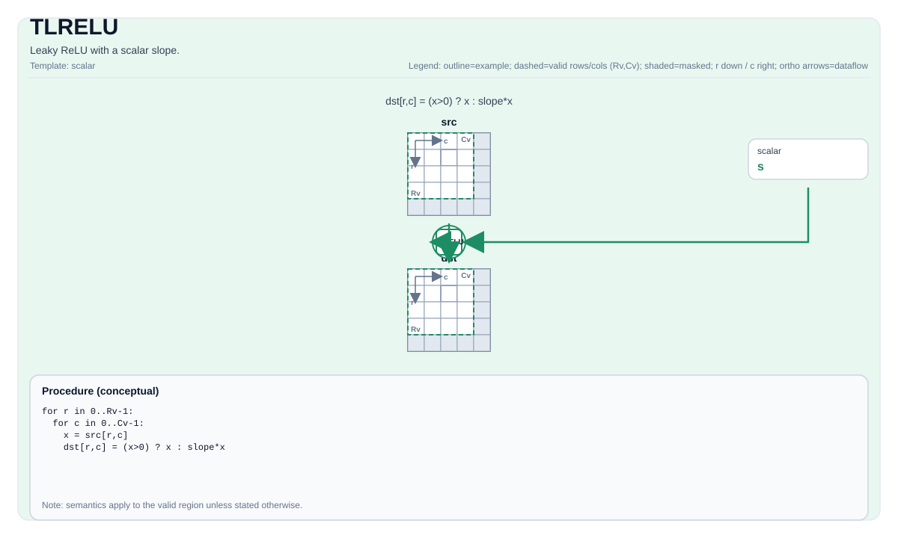

# TLRELU


## Tile Operation Diagram



## Introduction

Leaky ReLU with a scalar slope.

## Math Interpretation

For each element `(i, j)` in the valid region:

$$ \mathrm{dst}_{i,j} = (\mathrm{src}_{i,j} > 0) ? \mathrm{src}_{i,j} : (\mathrm{src}_{i,j} \cdot \mathrm{slope}) $$

## Assembly Syntax

PTO-AS form: see `docs/grammar/PTO-AS.md`.

Synchronous form:

```text
tlrelu %dst, %src, %slope : (!pto.tile<...>, !pto.tile<...>, f32)
```

### IR Level 1 (SSA)

```text
%dst = pto.tlrelu %src, %scalar : (!pto.tile<...>, dtype) -> !pto.tile<...>
```

### IR Level 2 (DPS)

```text
pto.tlrelu ins(%src, %scalar : !pto.tile_buf<...>, dtype) outs(%dst : !pto.tile_buf<...>)
```
## C++ Intrinsic

Declared in `include/pto/common/pto_instr.hpp`:

```cpp
template <typename TileData, typename... WaitEvents>
PTO_INST RecordEvent TLRELU(TileData& dst, TileData& src0, typename TileData::DType scalar, WaitEvents&... events);
```

## Constraints

- The op iterates over `dst.GetValidRow()` / `dst.GetValidCol()`.

## Examples

```cpp
#include <pto/pto-inst.hpp>

using namespace pto;

void example() {
  using TileT = Tile<TileType::Vec, float, 16, 16>;
  TileT x, out;
  TLRELU(out, x, 0.1f);
}
```

## ASM Form Examples

### Auto Mode

```text
# Auto mode: compiler/runtime-managed placement and scheduling.
%dst = pto.tlrelu %src, %scalar : (!pto.tile<...>, dtype) -> !pto.tile<...>
```

### Manual Mode

```text
# Manual mode: bind resources explicitly before issuing the instruction.
# Optional for tile operands:
# pto.tassign %arg0, @tile(0x1000)
# pto.tassign %arg1, @tile(0x2000)
%dst = pto.tlrelu %src, %scalar : (!pto.tile<...>, dtype) -> !pto.tile<...>
```

### PTO Assembly Form

```text
%dst = tlrelu %src, %slope : !pto.tile<...>, f32
# IR Level 2 (DPS)
pto.tlrelu ins(%src, %scalar : !pto.tile_buf<...>, dtype) outs(%dst : !pto.tile_buf<...>)
```

