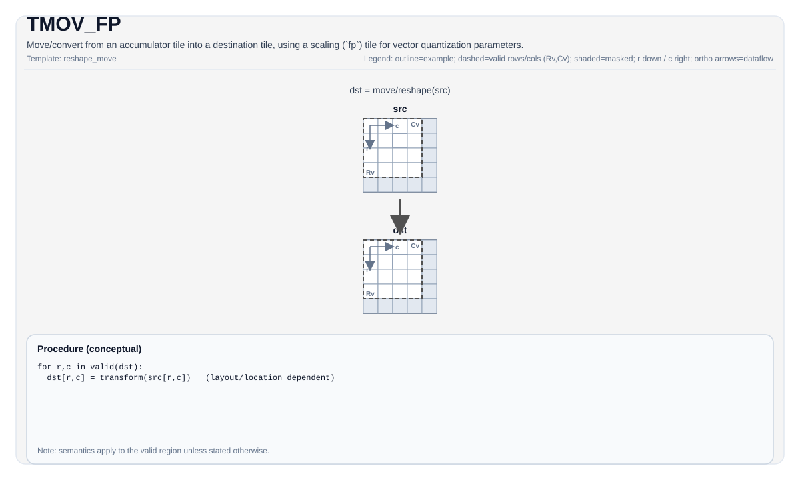

# TMOV_FP


## Tile Operation Diagram



## Introduction

Move/convert from an accumulator tile into a destination tile, using a scaling (`fp`) tile for vector quantization parameters.

`TMOV_FP` is a named wrapper around the `TMOV_IMPL(..., fp)` path and is part of the `TMOV` family (see `docs/isa/TMOV.md`).

## Math Interpretation

Conceptually converts each element using an implementation-defined quantization/dequantization configuration derived from `fp`:

$$ \mathrm{dst}_{i,j} = \mathrm{Convert}\!\left(\mathrm{src}_{i,j};\ \mathrm{fp}\right) $$

## Assembly Syntax

PTO-AS form: see `docs/grammar/PTO-AS.md`.

Synchronous form:

```text
tmov.fp %dst, %src, %fp : (!pto.tile<...>, !pto.tile<...>, !pto.tile<...>)
```

### IR Level 1 (SSA)

```text
%dst = pto.tmov.fp %src, %fp : !pto.tile<...>, !pto.tile<...> -> !pto.tile<...>
```

### IR Level 2 (DPS)

```text
pto.tmov.fp ins(%src, %fp : !pto.tile_buf<...>, !pto.tile_buf<...>) outs(%dst : !pto.tile_buf<...>)
```
## C++ Intrinsic

Declared in `include/pto/common/pto_instr.hpp` and `include/pto/common/constants.hpp`:

```cpp
template <typename DstTileData, typename SrcTileData, typename FpTileData,
          ReluPreMode reluMode = ReluPreMode::NoRelu, typename... WaitEvents>
PTO_INST RecordEvent TMOV_FP(DstTileData& dst, SrcTileData& src, FpTileData& fp, WaitEvents&... events);
```

## Constraints

- **Implementation checks (A2A3)**:
  - The fp path is only supported for accumulator conversion and is validated by internal compile-time checks in `TMOV_IMPL(dst, src, fp)`.
  - `FpTileData::Loc` must be `TileType::Scaling` (`static_assert`).
- **Implementation checks (A5)**:
  - Validated by `CheckTMovAccValid(...)` and related compile-time checks in `TMOV_IMPL(dst, src, fp)`.
  - `FpTileData::Loc` must be `TileType::Scaling` (`static_assert`).
  - Destination location is target-dependent (`Vec` or `Mat` are supported in the fp path).

## Examples

### Auto

```cpp
#include <pto/pto-inst.hpp>

using namespace pto;

void example_auto() {
  using AccT = TileAcc<float, 16, 16>;
  using DstT = Tile<TileType::Vec, int8_t, 16, 16>;
  using FpT = Tile<TileType::Scaling, uint64_t, 1, 16, BLayout::RowMajor, 1, 16, SLayout::NoneBox>;

  AccT acc;
  DstT dst;
  FpT fp;
  TMOV_FP(dst, acc, fp);
}
```

### Manual

```cpp
#include <pto/pto-inst.hpp>

using namespace pto;

void example_manual() {
  using AccT = TileAcc<float, 16, 16>;
  using DstT = Tile<TileType::Vec, int8_t, 16, 16>;
  using FpT = Tile<TileType::Scaling, uint64_t, 1, 16, BLayout::RowMajor, 1, 16, SLayout::NoneBox>;

  AccT acc;
  DstT dst;
  FpT fp;
  TASSIGN(acc, 0x1000);
  TASSIGN(dst, 0x2000);
  TASSIGN(fp,  0x3000);
  TMOV_FP(dst, acc, fp);
}
```

## ASM Form Examples

### Auto Mode

```text
# Auto mode: compiler/runtime-managed placement and scheduling.
%dst = pto.tmov.fp %src, %fp : !pto.tile<...>, !pto.tile<...> -> !pto.tile<...>
```

### Manual Mode

```text
# Manual mode: bind resources explicitly before issuing the instruction.
# Optional for tile operands:
# pto.tassign %arg0, @tile(0x1000)
# pto.tassign %arg1, @tile(0x2000)
%dst = pto.tmov.fp %src, %fp : !pto.tile<...>, !pto.tile<...> -> !pto.tile<...>
```

### PTO Assembly Form

```text
%dst = tmov.fp %src, %fp : !pto.tile<...>, !pto.tile<...> -> !pto.tile<...>
# IR Level 2 (DPS)
pto.tmov.fp ins(%src, %fp : !pto.tile_buf<...>, !pto.tile_buf<...>) outs(%dst : !pto.tile_buf<...>)
```

