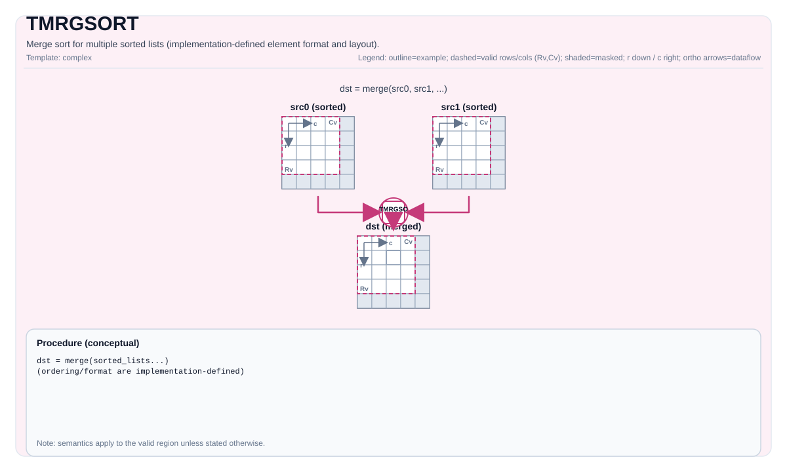

# TMRGSORT


## Tile Operation Diagram



## Introduction

Merge sort for multiple sorted lists (implementation-defined element format and layout).

## Math Interpretation

Merges sorted input lists into `dst`. Ordering, element format (e.g., value/index pairs), and the meaning of executed counts depend on the implementation.

$$ \mathrm{dst} = \mathrm{merge}(\mathrm{src}_0, \mathrm{src}_1, \ldots) $$

## Assembly Syntax

PTO-AS form: see `docs/grammar/PTO-AS.md`.

Synchronous form (conceptual):

```text
tmrgsort %dst, %executed, %tmp, %src0, %src1 {exhausted = false}
    : (!pto.tile<...>, vector<4xi16>, !pto.tile<...>, !pto.tile<...>, !pto.tile<...>)
```

### IR Level 1 (SSA)

```text
%dst = pto.tmrgsort %src, %blockLen : (!pto.tile<...>, dtype) -> !pto.tile<...>
%dst, %executed = pto.tmrgsort %src0, %src1, %src2, %src3 {exhausted = false}
 : (!pto.tile<...>, !pto.tile<...>, !pto.tile<...>, !pto.tile<...>) -> (!pto.tile<...>, vector<4xi16>)
```

### IR Level 2 (DPS)

```text
pto.tmrgsort ins(%src, %blockLen : !pto.tile_buf<...>, dtype)  outs(%dst : !pto.tile_buf<...>)
pto.tmrgsort ins(%src0, %src1, %src2, %src3 {exhausted = false} : !pto.tile_buf<...>, !pto.tile_buf<...>, !pto.tile_buf<...>, !pto.tile_buf<...>)
outs(%dst, %executed : !pto.tile_buf<...>, vector<4xi16>)
```
## C++ Intrinsic

Declared in `include/pto/common/pto_instr.hpp`:

```cpp
template <typename DstTileData, typename TmpTileData, typename Src0TileData,
          typename Src1TileData, typename Src2TileData, typename Src3TileData,
          bool exhausted, typename... WaitEvents>
PTO_INST RecordEvent TMRGSORT(DstTileData& dst, MrgSortExecutedNumList& executedNumList,
                             TmpTileData& tmp, Src0TileData& src0, Src1TileData& src1,
                             Src2TileData& src2, Src3TileData& src3, WaitEvents&... events);

template <typename DstTileData, typename TmpTileData, typename Src0TileData,
          typename Src1TileData, typename Src2TileData, bool exhausted, typename... WaitEvents>
PTO_INST RecordEvent TMRGSORT(DstTileData& dst, MrgSortExecutedNumList& executedNumList,
                             TmpTileData& tmp, Src0TileData& src0, Src1TileData& src1,
                             Src2TileData& src2, WaitEvents&... events);

template <typename DstTileData, typename TmpTileData, typename Src0TileData,
          typename Src1TileData, bool exhausted, typename... WaitEvents>
PTO_INST RecordEvent TMRGSORT(DstTileData& dst, MrgSortExecutedNumList& executedNumList,
                             TmpTileData& tmp, Src0TileData& src0, Src1TileData& src1, WaitEvents&... events);

template <typename DstTileData, typename SrcTileData, typename... WaitEvents>
PTO_INST RecordEvent TMRGSORT(DstTileData& dst, SrcTileData& src, uint32_t blockLen, WaitEvents&... events);
```

## Constraints

- **Implementation checks (A2A3/A5)**:
  - Element type must be `half` or `float` and must match across `dst/tmp/src*` tiles.
  - All tiles must be `TileType::Vec`, row-major, and have `Rows == 1` (list stored in a single row).
  - UB memory usage is checked (compile-time and runtime) against target limits (single `Cols` across inputs plus `tmp`/`dst`).
- **Single-list variant (`TMRGSORT(dst, src, blockLen)`)**:
  - `blockLen` must be a multiple of 64 (as checked by the implementation).
  - `src.GetValidCol()` must be an integer multiple of `blockLen * 4`.
  - `repeatTimes = src.GetValidCol() / (blockLen * 4)` must be in `[1, 255]`.
- **Multi-list variants**:
  - `tmp` is required and `executedNumList` is written by the implementation; supported list counts and exact semantics are target-defined.

## Examples

### Auto

```cpp
#include <pto/pto-inst.hpp>

using namespace pto;

void example_auto() {
  using SrcT = Tile<TileType::Vec, float, 1, 256>;
  using DstT = Tile<TileType::Vec, float, 1, 256>;
  SrcT src;
  DstT dst;
  TMRGSORT(dst, src, /*blockLen=*/64);
}
```

### Manual

```cpp
#include <pto/pto-inst.hpp>

using namespace pto;

void example_manual() {
  using SrcT = Tile<TileType::Vec, float, 1, 256>;
  using DstT = Tile<TileType::Vec, float, 1, 256>;
  SrcT src;
  DstT dst;
  TASSIGN(src, 0x1000);
  TASSIGN(dst, 0x2000);
  TMRGSORT(dst, src, /*blockLen=*/64);
}
```

## ASM Form Examples

### Auto Mode

```text
# Auto mode: compiler/runtime-managed placement and scheduling.
%dst = pto.tmrgsort %src, %blockLen : (!pto.tile<...>, dtype) -> !pto.tile<...>
```

### Manual Mode

```text
# Manual mode: bind resources explicitly before issuing the instruction.
# Optional for tile operands:
# pto.tassign %arg0, @tile(0x1000)
# pto.tassign %arg1, @tile(0x2000)
%dst = pto.tmrgsort %src, %blockLen : (!pto.tile<...>, dtype) -> !pto.tile<...>
```

### PTO Assembly Form

```text
%dst = pto.tmrgsort %src, %blockLen : (!pto.tile<...>, dtype) -> !pto.tile<...>
# IR Level 2 (DPS)
pto.tmrgsort ins(%src, %blockLen : !pto.tile_buf<...>, dtype)  outs(%dst : !pto.tile_buf<...>)
```

