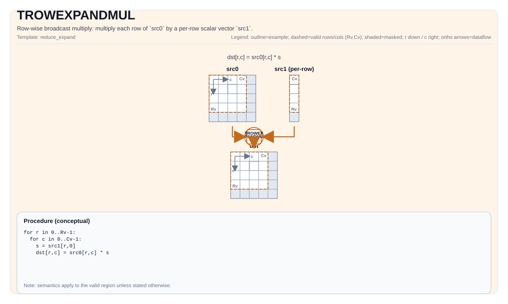

# TROWEXPANDMUL


## Tile Operation Diagram



## Introduction

Row-wise broadcast multiply: multiply each row of `src0` by a per-row scalar vector `src1`.

## Math Interpretation

For each element `(i, j)` in the valid region:

$$ \mathrm{dst}_{i,j} = \mathrm{src0}_{i,j} \cdot \mathrm{src1}_{0,i} $$

## Assembly Syntax

PTO-AS form: see `docs/grammar/PTO-AS.md`.

Synchronous form:

```text
trowexpandmul %dst, %src0, %src1 : (!pto.tile<...>, !pto.tile<...>, !pto.tile<...>)
```

### IR Level 1 (SSA)

```text
%dst = pto.tcolexpandmul %src0, %src1 : !pto.tile<...>, !pto.tile<...> -> !pto.tile<...>
```

### IR Level 2 (DPS)

```text
pto.tcolexpandmul ins(%src0, %src1 : !pto.tile_buf<...>, !pto.tile_buf<...>) outs(%dst : !pto.tile_buf<...>)
```
## C++ Intrinsic

Declared in `include/pto/common/pto_instr.hpp`:

```cpp
template <typename TileDataDst, typename TileDataSrc1, typename... WaitEvents>
PTO_INST RecordEvent TROWEXPANDMUL(TileDataDst& dst, TileDataDst& src0, TileDataSrc1& src1, WaitEvents&... events);
```

## Constraints

- **Implementation checks**:
  - `TileDataDst::DType == TileDataSrc0::DType == TileDataSrc1::DType` (compile-time).
  - `TileDataDst::DType`, `TileDataSrc0::DType`, `TileDataSrc1::DType` must be one of: `half`, `float`.
  - Tile shape/layout constraint (compile-time): `TileDataDst::isRowMajor`.
  - Mode 1: `src1` is expected to provide **one scalar per row** (i.e., its valid shape must cover `R` values).
  - Mode 2: `src1` is expected to provide **32 bytes data per row**.

## Examples

### Auto

```cpp
#include <pto/pto-inst.hpp>

using namespace pto;

void example_auto() {
  using TileT = Tile<TileType::Vec, half, 16, 16>;
  using RowVecT = Tile<TileType::Vec, half, 16, 1, BLayout::ColMajor, 1, DYNAMIC, SLayout::NoneBox>;

  TileT src0, dst;
  RowVecT src1(16);
  TROWEXPANDMUL(dst, src0, src1);
}
```

### Manual

```cpp
#include <pto/pto-inst.hpp>

using namespace pto;

void example_manual() {
  using TileT = Tile<TileType::Vec, half, 16, 16>;
  using RowVecT = Tile<TileType::Vec, half, 16, 1, BLayout::ColMajor, 1, DYNAMIC, SLayout::NoneBox>;

  TileT src0, dst;
  RowVecT src1(16);
  TASSIGN(src0, 0x1000);
  TASSIGN(dst,  0x2000);
  TASSIGN(src1, 0x3000);
  TROWEXPANDMUL(dst, src0, src1);
}
```

## ASM Form Examples

### Auto Mode

```text
# Auto mode: compiler/runtime-managed placement and scheduling.
%dst = pto.tcolexpandmul %src0, %src1 : !pto.tile<...>, !pto.tile<...> -> !pto.tile<...>
```

### Manual Mode

```text
# Manual mode: bind resources explicitly before issuing the instruction.
# Optional for tile operands:
# pto.tassign %arg0, @tile(0x1000)
# pto.tassign %arg1, @tile(0x2000)
%dst = pto.tcolexpandmul %src0, %src1 : !pto.tile<...>, !pto.tile<...> -> !pto.tile<...>
```

### PTO Assembly Form

```text
%dst = trowexpandmul %src0, %src1 : !pto.tile<...>, !pto.tile<...> -> !pto.tile<...>
# IR Level 2 (DPS)
pto.tcolexpandmul ins(%src0, %src1 : !pto.tile_buf<...>, !pto.tile_buf<...>) outs(%dst : !pto.tile_buf<...>)
```

