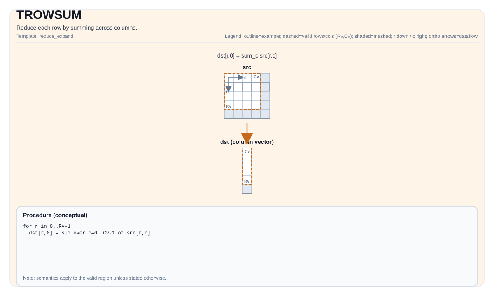

# TROWSUM


## Tile Operation Diagram



## Introduction

Reduce each row by summing across columns.

## Math Interpretation

Let `R = src.GetValidRow()` and `C = src.GetValidCol()`. For `0 <= i < R`:

$$ \mathrm{dst}_{i,0} = \sum_{j=0}^{C-1} \mathrm{src}_{i,j} $$

## Assembly Syntax

PTO-AS form: see `docs/grammar/PTO-AS.md`.

Synchronous form:

```text
trowsum %dst, %src : (!pto.tile<...>, !pto.tile<...>)
```
Lowering may introduce internal scratch tiles; the C++ intrinsic requires an explicit `tmp` operand.

### IR Level 1 (SSA)

```text
%dst = pto.trowsum %src, %tmp : (!pto.tile<...>, !pto.tile<...>) -> !pto.tile<...>
```

### IR Level 2 (DPS)

```text
pto.trowsum ins(%src, %tmp : !pto.tile_buf<...>, !pto.tile_buf<...>) outs(%dst : !pto.tile_buf<...>)
```
## C++ Intrinsic

Declared in `include/pto/common/pto_instr.hpp`:

```cpp
template <typename TileDataOut, typename TileDataIn, typename TileDataTmp, typename... WaitEvents>
PTO_INST RecordEvent TROWSUM(TileDataOut& dst, TileDataIn& src, TileDataTmp& tmp, WaitEvents&... events);
```

## Constraints

Implementation checks (NPU):

- A2A3:
  - Tile location: `dst` and `src` must be `TileType::Vec`.
  - Tile layout of `src`: ND fractal (`isRowMajor` and `SLayout::NoneBox`).
  - Tile layout of `dst`:
    - **Recommended**: DN layout Tile of 1D, e.g., `Tile<TileType::Vec, T, ROWS, 1, BLayout::ColMajor, ValidRows, 1>`
    - **To be removed**: ND layout Tile of 2D, e.g., `Tile<TileType::Vec, T, ROWS, COLS, BLayout::RowMajor, ValidRows, 1>`
  - Data types: `half` or `float`.
  - DType consistency: `dst.DType == src.DType`.
  - Runtime valid checks:
    - `srcValidCol != 0` and `srcValidRow != 0`.
    - `srcValidRow == dstValidRow` (the output valid row must match the input valid row).
- A5:
  - Data types: `half` or `float`.
  - DType consistency: `dst.DType == src.DType`.
  - No explicit runtime assertions on `validRow/validCol` in the implementation; the loops use `src.GetValidRow()` and `src.GetValidCol()`.

## Examples

### Auto

```cpp
#include <pto/pto-inst.hpp>

using namespace pto;

void example_auto() {
  using SrcT = Tile<TileType::Vec, float, 16, 16>;
  using DstT = Tile<TileType::Vec, float, 16, 1, BLayout::ColMajor>;
  using TmpT = Tile<TileType::Vec, float, 16, 16>;
  SrcT src;
  DstT dst;
  TmpT tmp;
  TROWSUM(dst, src, tmp);
}
```

### Manual

```cpp
#include <pto/pto-inst.hpp>

using namespace pto;

void example_manual() {
  using SrcT = Tile<TileType::Vec, float, 16, 16>;
  using DstT = Tile<TileType::Vec, float, 16, 1, BLayout::ColMajor>;
  using TmpT = Tile<TileType::Vec, float, 16, 16>;
  SrcT src;
  DstT dst;
  TmpT tmp;
  TASSIGN(src, 0x1000);
  TASSIGN(dst, 0x2000);
  TASSIGN(tmp, 0x3000);
  TROWSUM(dst, src, tmp);
}
```

## ASM Form Examples

### Auto Mode

```text
# Auto mode: compiler/runtime-managed placement and scheduling.
%dst = pto.trowsum %src, %tmp : (!pto.tile<...>, !pto.tile<...>) -> !pto.tile<...>
```

### Manual Mode

```text
# Manual mode: bind resources explicitly before issuing the instruction.
# Optional for tile operands:
# pto.tassign %arg0, @tile(0x1000)
# pto.tassign %arg1, @tile(0x2000)
%dst = pto.trowsum %src, %tmp : (!pto.tile<...>, !pto.tile<...>) -> !pto.tile<...>
```

### PTO Assembly Form

```text
%dst = trowsum %src : !pto.tile<...> -> !pto.tile<...>
# IR Level 2 (DPS)
pto.trowsum ins(%src, %tmp : !pto.tile_buf<...>, !pto.tile_buf<...>) outs(%dst : !pto.tile_buf<...>)
```

