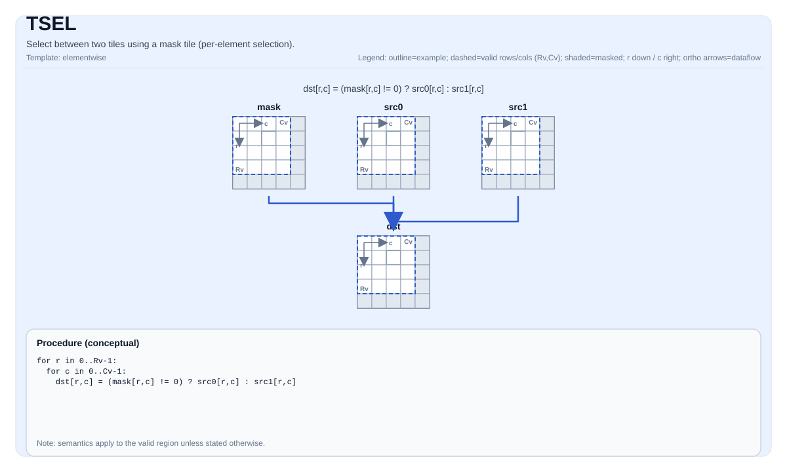

# TSEL


## Tile Operation Diagram



## Introduction

Select between two tiles using a mask tile (per-element selection).

## Math Interpretation

For each element `(i, j)` in the valid region:

$$
\mathrm{dst}_{i,j} =
\begin{cases}
\mathrm{src0}_{i,j} & \text{if } \mathrm{mask}_{i,j}\ \text{is true} \\
\mathrm{src1}_{i,j} & \text{otherwise}
\end{cases}
$$

## Assembly Syntax

PTO-AS form: see `docs/grammar/PTO-AS.md`.

Synchronous form:

```text
tsel %dst, %mask, %src0, %src1 : (!pto.tile<...>, !pto.tile<...>, !pto.tile<...>, !pto.tile<...>)
```

### IR Level 1 (SSA)

```text
%dst = pto.tsel %mask, %src0, %src1 : (!pto.tile<...>, !pto.tile<...>, !pto.tile<...>) -> !pto.tile<...>
```

### IR Level 2 (DPS)

```text
pto.tsel ins(%mask, %src0, %src1 : !pto.tile_buf<...>, !pto.tile_buf<...>, !pto.tile_buf<...>) outs(%dst : !pto.tile_buf<...>)
```
## C++ Intrinsic

Declared in `include/pto/common/pto_instr.hpp`:

```cpp
template <typename TileData, typename MaskTile, typename... WaitEvents>
PTO_INST RecordEvent TSEL(TileData& dst, MaskTile& selMask, TileData& src0, TileData& src1, WaitEvents&... events);
```

## Constraints

- **Implementation checks (A2A3)**:
  - `sizeof(TileData::DType)` must be `2` or `4` bytes.
  - `TileData::DType` must be `int16_t` or `uint16_t` or `int32_t` or `uint32_t` or `half` or `bfloat16_t` or `float`.
  - No explicit assertions are enforced on the mask tile type/shape; mask encoding is target-defined.
  - The implementation uses `dst.GetValidRow()` / `dst.GetValidCol()` for the selection domain.
- **Implementation checks (A5)**:
  - `sizeof(TileData::DType)` must be `2` or `4` bytes.
  - `TileData::DType` must be `int16_t` or `uint16_t` or `int32_t` or `uint32_t` or `half` or `bfloat16_t` or `float`.
  - No explicit `static_assert`/`PTO_ASSERT` checks are enforced by `TSEL_IMPL`.
  - The implementation uses `dst.GetValidRow()` / `dst.GetValidCol()` for the selection domain.
- **Mask encoding**:
  - The mask tile is interpreted as packed predicate bits in a target-defined layout.

## Examples

### Auto

```cpp
#include <pto/pto-inst.hpp>

using namespace pto;

void example_auto() {
  using TileT = Tile<TileType::Vec, float, 16, 16>;
  using MaskT = Tile<TileType::Vec, uint8_t, 16, 32, BLayout::RowMajor, -1, -1>;
  TileT src0, src1, dst;
  MaskT mask(16, 2);
  TSEL(dst, mask, src0, src1);
}
```

### Manual

```cpp
#include <pto/pto-inst.hpp>

using namespace pto;

void example_manual() {
  using TileT = Tile<TileType::Vec, float, 16, 16>;
  using MaskT = Tile<TileType::Vec, uint8_t, 16, 32, BLayout::RowMajor, -1, -1>;
  TileT src0, src1, dst;
  MaskT mask(16, 2);
  TASSIGN(src0, 0x1000);
  TASSIGN(src1, 0x2000);
  TASSIGN(dst,  0x3000);
  TASSIGN(mask, 0x4000);
  TSEL(dst, mask, src0, src1);
}
```

## ASM Form Examples

### Auto Mode

```text
# Auto mode: compiler/runtime-managed placement and scheduling.
%dst = pto.tsel %mask, %src0, %src1 : (!pto.tile<...>, !pto.tile<...>, !pto.tile<...>) -> !pto.tile<...>
```

### Manual Mode

```text
# Manual mode: bind resources explicitly before issuing the instruction.
# Optional for tile operands:
# pto.tassign %arg0, @tile(0x1000)
# pto.tassign %arg1, @tile(0x2000)
%dst = pto.tsel %mask, %src0, %src1 : (!pto.tile<...>, !pto.tile<...>, !pto.tile<...>) -> !pto.tile<...>
```

### PTO Assembly Form

```text
%dst = tsel %mask, %src0, %src1 : !pto.tile<...>
# IR Level 2 (DPS)
pto.tsel ins(%mask, %src0, %src1 : !pto.tile_buf<...>, !pto.tile_buf<...>, !pto.tile_buf<...>) outs(%dst : !pto.tile_buf<...>)
```

