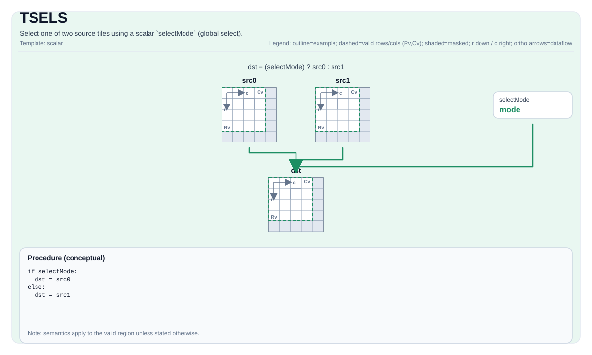

# TSELS


## Tile Operation Diagram



## Introduction

Select between source tile and scalar using a mask tile (per-element selection for source tile).

## Math Interpretation

For each element `(i, j)` in the valid region:

$$
\mathrm{dst}_{i,j} =
\begin{cases}
\mathrm{src}_{i,j} & \text{if } \mathrm{mask}_{i,j}\ \text{is true} \\
\mathrm{scalar} & \text{otherwise}
\end{cases}
$$

## Assembly Syntax

PTO-AS form: see `docs/grammar/PTO-AS.md`.

Synchronous form:

```text
%dst = tsel %mask, %src, %scalar : !pto.tile<...>
```

### IR Level 1 (SSA)

```text
%dst = pto.tsels %src0, %src1, %scalar : (!pto.tile<...>, !pto.tile<...>, dtype) -> !pto.tile<...>
```

### IR Level 2 (DPS)

```text
pto.tsels ins(%src0, %src1, %scalar : !pto.tile_buf<...>, !pto.tile_buf<...>, dtype) outs(%dst : !pto.tile_buf<...>)
```
## IR Syntax

### IR-level1 (SSA)

```mlir
%dst = pto.tsels %src0, %src1, %scalar : (!pto.tile<...>, dtype, !pto.tile<...>) -> !pto.tile<...>
```

### IR-level2 (DPS)

```mlir
pto.tsels ins(%src0, %src1, %scalar : !pto.tile_buf<...>, dtype, !pto.tile_buf<...>) outs(%dst : !pto.tile_buf<...>)
```

## C++ Intrinsic

Declared in `include/pto/common/pto_instr.hpp`:

```cpp
template <typename TileDataDst, typename TileDataMask, typename TileDataSrc, typename... WaitEvents>
PTO_INST RecordEvent TSELS(TileDataDst &dst, TileDataMask &mask, TileDataSrc &src, typename TileDataSrc::DType scalar,
                           WaitEvents &... events);
```

## Constraints

- **Implementation checks (A2A3)**:
  - `sizeof(TileDataDst::DType)` and `sizeof(TileDataSrc::DType)` must be `2` or `4` bytes.
  - Supported `DType`: `int16_t`, `uint16_t`, `int32_t, `uint32_t`, `half`, `float`.
  - No explicit assertions are enforced on the mask tile type/shape; mask encoding is target-defined.
  - The implementation uses `dst.GetValidRow()` / `dst.GetValidCol()` for the selection domain.
- **Implementation checks (A5)**:
  - `sizeof(TileData::DType)` must be `2` or `4` bytes.
  - Supported `DType`: `int8_t`, `uint8_t`, `int16_t`, `uint16_t`, `int32_t`, `uint32_t`, `half`, `float`.
  - No explicit assertions are enforced on the mask tile type/shape; mask encoding is target-defined.
  - The implementation uses `dst.GetValidRow()` / `dst.GetValidCol()` for the selection domain.
- **Mask encoding**:
  - The mask tile is interpreted as packed predicate bits in a target-defined layout.

## Examples

### Auto

```cpp
#include <pto/pto-inst.hpp>

using namespace pto;

void example_auto() {
  using TileDst = Tile<TileType::Vec, float, 16, 16>;
  using TileSrc = Tile<TileType::Vec, float, 16, 16>;
  using TileMask = Tile<TileType::Vec, uint8_t, 16, 32, BLayout::RowMajor, -1, -1>;
  TileDst dst;
  TileSrc src;
  TileMask mask(16, 2);
  TSELS(dst, mask, src, scalar);
}
```

### Manual

```cpp
#include <pto/pto-inst.hpp>

using namespace pto;

void example_manual() {
  using TileDst = Tile<TileType::Vec, float, 16, 16>;
  using TileSrc = Tile<TileType::Vec, float, 16, 16>;
  using TileMask = Tile<TileType::Vec, uint8_t, 16, 32, BLayout::RowMajor, -1, -1>;
  TileDst dst;
  TileSrc src;
  TileMask mask(16, 2);
  TASSIGN(src, 0x1000);
  TASSIGN(dst,  0x3000);
  TASSIGN(mask, 0x4000);
  TSELS(dst, mask, src, scalar);
}
```

## ASM Form Examples

### Auto Mode

```text
# Auto mode: compiler/runtime-managed placement and scheduling.
%dst = pto.tsels %src0, %src1, %scalar : (!pto.tile<...>, !pto.tile<...>, dtype) -> !pto.tile<...>
```

### Manual Mode

```text
# Manual mode: bind resources explicitly before issuing the instruction.
# Optional for tile operands:
# pto.tassign %arg0, @tile(0x1000)
# pto.tassign %arg1, @tile(0x2000)
%dst = pto.tsels %src0, %src1, %scalar : (!pto.tile<...>, !pto.tile<...>, dtype) -> !pto.tile<...>
```

### PTO Assembly Form

```text
%dst = tsels %src0, %src1, %selectMode : !pto.tile<...>
# IR Level 2 (DPS)
pto.tsels ins(%src0, %src1, %scalar : !pto.tile_buf<...>, !pto.tile_buf<...>, dtype) outs(%dst : !pto.tile_buf<...>)
```

