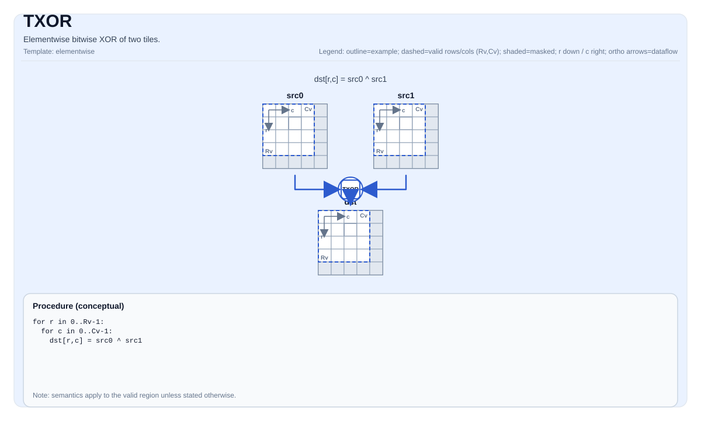

# TXOR


## Tile Operation Diagram



## Introduction

Elementwise bitwise XOR of two tiles.

## Math Interpretation

For each element `(i, j)` in the valid region:

$$ \mathrm{dst}_{i,j} = \mathrm{src0}_{i,j} \oplus \mathrm{src1}_{i,j} $$

## Assembly Syntax

PTO-AS form: see `docs/grammar/PTO-AS.md`.

Synchronous form:

```text
txor %dst, %src0, %src1 : (!pto.tile<...>, !pto.tile<...>, !pto.tile<...>)
```

### IR Level 1 (SSA)

```text
%dst = pto.txor %src0, %src1 : (!pto.tile<...>, !pto.tile<...>) -> !pto.tile<...>
```

### IR Level 2 (DPS)

```text
pto.txor ins(%src0, %src1 : !pto.tile_buf<...>, !pto.tile_buf<...>) outs(%dst : !pto.tile_buf<...>)
```
## C++ Intrinsic

Declared in `include/pto/common/pto_instr.hpp`:

```cpp
template <typename TileDataDst, typename TileDataSrc0, typename TileDataSrc1, typename TileDataTmp, typename... WaitEvents>
PTO_INST RecordEvent TXOR(TileDataDst& dst, TileDataSrc0& src0, TileDataSrc1& src1, TileDataTmp& tmp, WaitEvents&... events);
```

## Constraints

- Intended for integral element types.
- The op iterates over `dst.GetValidRow()` / `dst.GetValidCol()`.
- Temporary space is required by A3 for calculation, while not used by A5.
- For A3, 2 source Tile, destination Tile, temporary space must in different memory range without overlapping.

## Examples

```cpp
#include <pto/pto-inst.hpp>

using namespace pto;

void example() {
  using TileDst = Tile<TileType::Vec, uint32_t, 16, 16>;
  using TileSrc0 = Tile<TileType::Vec, uint32_t, 16, 16>;
  using TileSrc1 = Tile<TileType::Vec, uint32_t, 16, 16>;
  using TileTmp = Tile<TileType::Vec, uint32_t, 16, 16>;
  TileDst dst;
  TileSrc0 src0;
  TileSrc1 src1;
  TileTmp tmp;
  TXOR(dst, src0, src1, tmp);
}
```

## ASM Form Examples

### Auto Mode

```text
# Auto mode: compiler/runtime-managed placement and scheduling.
%dst = pto.txor %src0, %src1 : (!pto.tile<...>, !pto.tile<...>) -> !pto.tile<...>
```

### Manual Mode

```text
# Manual mode: bind resources explicitly before issuing the instruction.
# Optional for tile operands:
# pto.tassign %arg0, @tile(0x1000)
# pto.tassign %arg1, @tile(0x2000)
%dst = pto.txor %src0, %src1 : (!pto.tile<...>, !pto.tile<...>) -> !pto.tile<...>
```

### PTO Assembly Form

```text
%dst = txor %src0, %src1 : !pto.tile<...>
# IR Level 2 (DPS)
pto.txor ins(%src0, %src1 : !pto.tile_buf<...>, !pto.tile_buf<...>) outs(%dst : !pto.tile_buf<...>)
```

